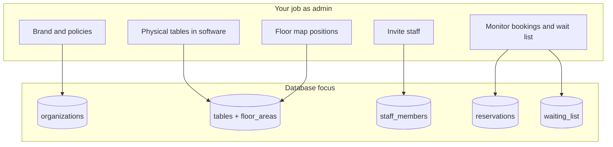
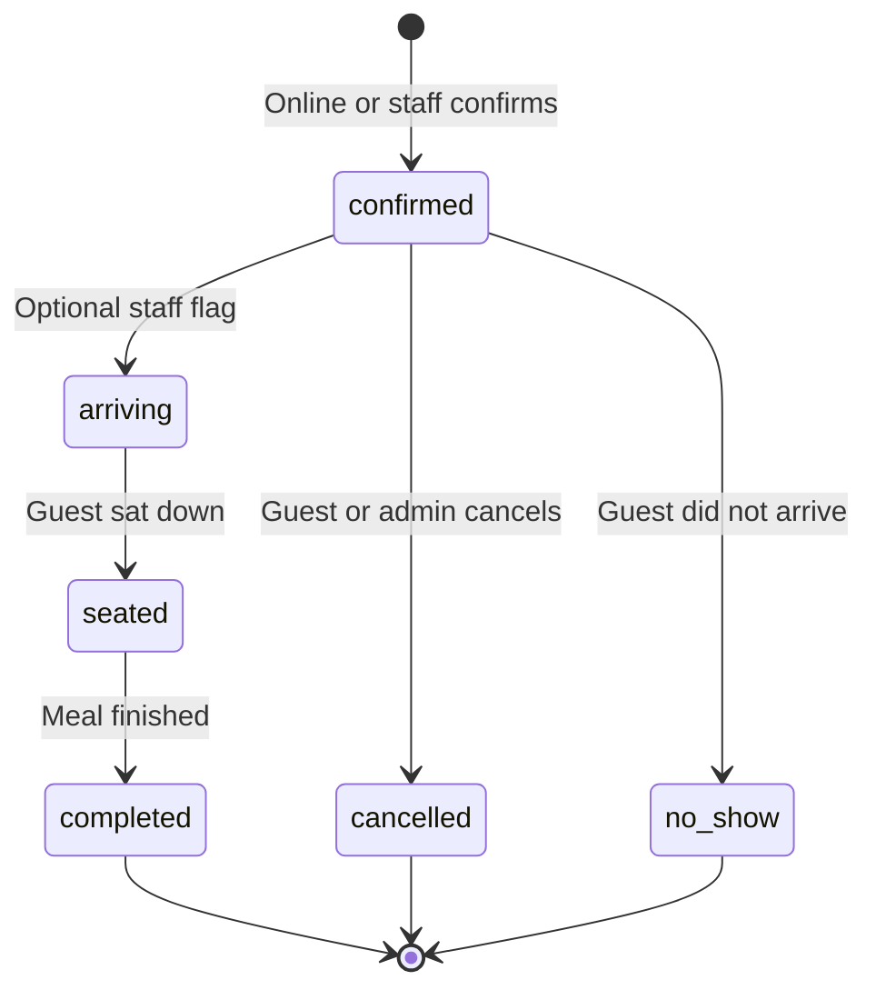
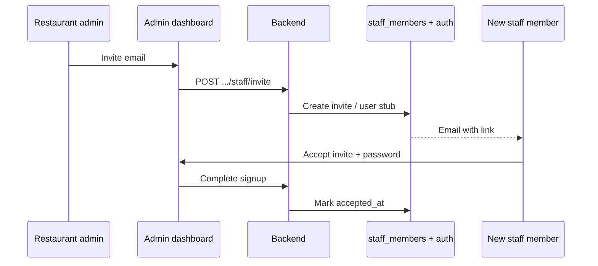
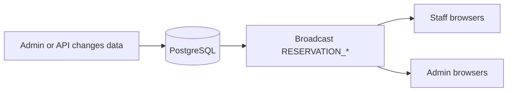

# Dinely — Admin and restaurant owner handover guide

**Audience:** Owner, general manager, or head of operations configuring Dinely before and during service.

This guide maps **each admin dashboard area** to **what it does in the product**, **what data it changes**, and **how guests and staff feel the effect**.

---

## 1. Admin role in one diagram

You reach the dashboard at **`/admin`** after logging in as the restaurant’s primary account (created at owner signup in `AuthService.signup`).

---

## 2. Dashboard shell and stats

The admin home (`src/pages/admin/AdminDashboard.tsx`) shows four summary tiles fed by `GET /organizations/:orgId/dashboard/stats`:

- **Today’s bookings** — Count of reservations for the current service date.
- **Seated now** — How many parties are marked seated.
- **Tables** — Count of active tables.
- **Total staff** — Team members on file.

The page **polls every 15 seconds** and also listens for **realtime reservation events** on the Supabase channel `restaurant_{orgId}` so numbers refresh quickly when someone books online.

---

## 3. Tab: Reservation

**Purpose:** Operational view of reservations for a selected day, aligned with table list from `GET /organizations/:orgId/tables` and reservations from `GET /organizations/:orgId/reservations`.

**Typical actions**

- Review who is coming, at what time, and on which table.
- Add or adjust bookings that arrived by phone (exact buttons depend on current UI; data goes to the same `reservations` table as the website).

**Behind the scenes:** Each reservation row stores `reservation_date`, `start_time`, `end_time`, `party_size`, guest fields, `status`, `source`, optional `customer_id`, and `table_id`.

Exact transitions are enforced in `ReservationService` on the server (`VALID_TRANSITIONS` in `backend/src/services/reservation.service.ts`).

---

## 4. Tab: Tables Management

**Purpose:** Define the inventory of seats the booking engine can sell.

**Data model**

- **`floor_areas`** — Optional sections (e.g. Patio, Main Room).
- **`tables`** — Each row is one bookable unit: `table_number`, display `name`, `capacity`, optional `min_capacity`, `shape`, merge flags, premium flags (`is_premium`, `premium_price` in later migrations), `position_x` / `position_y` for the map, `is_active`.

**Guest impact**

- Only **active** tables are offered on public endpoints (`listPublicTables`).
- **Inactive** tables disappear from online booking but remain in history.

**Staff impact**

- Table capacity drives **party size filtering** when the guest picks a table.

---

## 5. Tab: Floor Map

**Purpose:** Drag-and-drop layout so the on-screen map matches the dining room.

**Data:** Updates `position_x`, `position_y` (and related layout fields) on `tables`.

**Why it matters:** Staff live view reads the same coordinates to render circles or cards in the right arrangement. Colours on the staff map come from **reservation status**, not from the floor map editor itself.

---

## 6. Tab: Staff Management

**Purpose:** Invite people who will use the **staff** URL for your restaurant.

**Flow**

1. Admin opens invite modal, enters email and role (the current UI defaults new invites to **Manager**; see `StaffManagementTab.tsx`).
2. Backend creates an invite token and sends instructions; the invitee visits `/accept-invite?token=...`, sets a password, and is linked to `staff_members` for your `organizations.id`.

**Important:** Staff accounts are **separate** from the owner admin account. Revoking or deleting a staff row removes their access without changing your tables or reservations.

---

## 7. Tab: Waiting List

**Purpose:** Capture demand when you are full or guests prefer a callback.

**Data:** Rows in `waiting_list` with party size, contact info, requested date/time, and status.

---

## 8. Tab: Support and Feedback

**Purpose:** Channel for operational questions or product feedback (content is defined in `SupportTab` implementation). Use this to centralize issues your team finds during rollout.

---

## 9. Tab: Settings (the control centre)

Settings (`SettingsTab.tsx`) map closely to columns on `organizations`. Highlights the client should know:

| Setting area | Guest effect | Staff / admin effect |
|--------------|----------------|----------------------|
| **Name, address, phone, email** | Shown on communications and public info | Contact clarity for team |
| **Logo, widget heading, widget CTA, widget background** | Booking wizard header appearance | None |
| **Weekly hours + default open/close** | Which slots exist | Same hours power staff wizards |
| **Timezone** | Correct “today” boundary | Reporting accuracy |
| **Currency** | Display of fees | Financial copy |
| **Default reservation duration** | How long a table stays blocked | Turn time planning |
| **Min / max advance booking** | How far ahead or how soon guests can book | Policy control |
| **Max party size** | Wizard validation | Large-party handling |
| **Allow mergeable tables** | If off, merge UX may be hidden | Enables large-party merges when on |
| **Allow walk-ins** | May surface messaging | Staff can seat without prior booking when policy allows |
| **Require payment / Stripe** | May trigger payment step in wizard | Revenue collection |
| **VIP membership fee** | Premium program pricing context | Marketing alignment |
| **Cancellation policy text** | Shown to guests where applicable | Legal / brand |
| **Staff IP login** | None | Optional restriction: staff login only from trusted IPs |
| **Branding colour / email custom note** | Email and theme touches | Professional polish |

**Booking links** shown in Settings typically follow:

- `.../book-a-table/{slug}`
- `.../staff-login/{slug}`

(Helpers in `src/utils/restaurantRoutes.ts`.)

---

## 10. Stripe (when enabled)

If your deployment uses Stripe Connect for the restaurant, Settings exposes connection status (`stripeOnboardingComplete`). **Card charges and payouts** follow Stripe’s rules; Dinely stores reservation and fee metadata as configured in your build. Train finance staff on Stripe’s dashboard as the source of truth for money movement.

---

## 11. First-time setup wizard

New organizations may be guided through **`/setup`** (`SetupWizard`) to reach `setup_completed` on the organization. This is the **onboarding interview** that complements manual table entry.

---

## 12. Platform super-admin (FYI only)

Routes under `/admin/super` serve **platform operators**, not day-to-day restaurants. Your client handover normally **excludes** this area unless you are the SaaS owner reviewing all tenants.

---

## 13. How admin actions reach guests instantly

When any API changes reservations, the backend can broadcast on `restaurant_{orgId}`. Staff devices subscribed to that channel refresh lists and map colours without manual reload.

---

## Related documents

- [`CLIENT_HANDOVER_PHASES.md`](./CLIENT_HANDOVER_PHASES.md)
- [`CLIENT_HANDOVER_CUSTOMER_AND_GUEST.md`](./CLIENT_HANDOVER_CUSTOMER_AND_GUEST.md)
- [`CLIENT_HANDOVER_STAFF_OPERATIONS.md`](./CLIENT_HANDOVER_STAFF_OPERATIONS.md)
- [`admin_guide.md`](./admin_guide.md) — shorter checklist version
