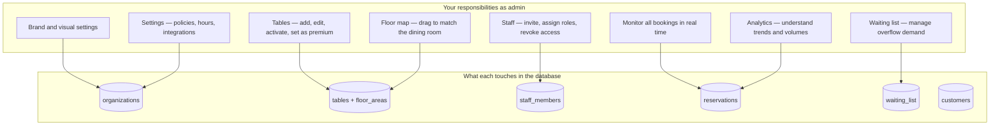
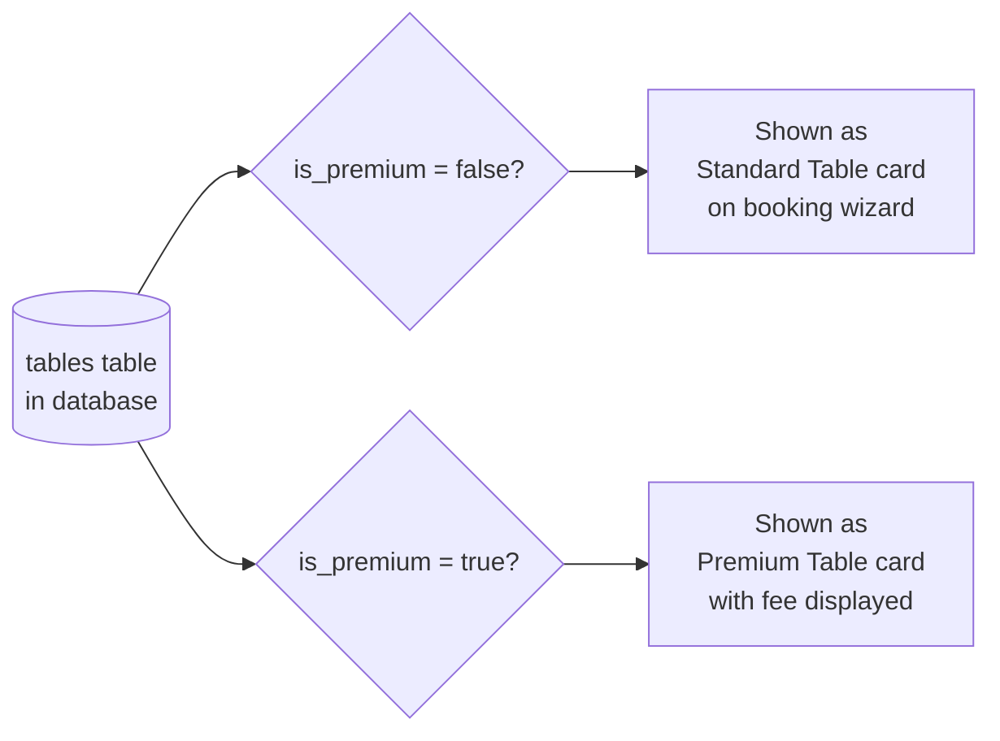
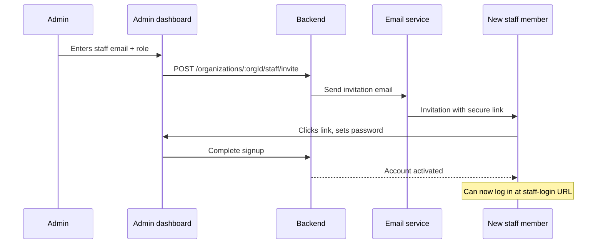
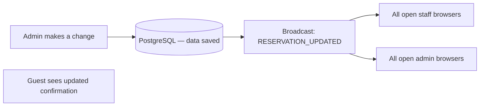

# Dinely — Admin and Restaurant Owner Handover Guide

**Audience:** Owner, general manager, or head of operations configuring and running Dinely before and during service.

This guide maps **each admin dashboard area** to **what it does**, **what data it changes**, and **how guests and staff feel the effect** — explained in plain English.

---

## 1. Your role as admin in one diagram



You reach the dashboard at **`/admin`** after logging in with the restaurant owner account created during signup.

---

## 2. Dashboard shell and live stats

The admin home (`AdminDashboard`) shows four live tiles at the top, refreshed every 15 seconds and also updated instantly when any reservation event occurs:

| Tile | What it shows |
|------|--------------|
| **Today's Bookings** | Count of reservations for today |
| **Seated Now** | Parties currently marked as seated |
| **Tables** | Number of active tables in the system |
| **Total Staff** | Team members on file |

Above the tab navigation there is an **Analytics Report** button — see Section 10 for full details.

---

## 3. Tab: Reservation

The Reservation tab gives you a full operational view of the day's bookings, identical in data to what staff see on their dashboard but within the admin interface.

### 3.1 What you can do here

- Browse all reservations for a chosen date
- Review guest names, party sizes, times, tables, and statuses
- Create new reservations (phone bookings) using the staff creation wizard
- Update reservation statuses directly

### 3.2 Reservation lifecycle

Every booking moves through defined statuses. This protects data integrity — the system only allows logical transitions:

```mermaid
stateDiagram-v2
  [*] --> confirmed: Guest books online, or staff creates
  confirmed --> arriving: Optional — staff flags guest is on their way
  arriving --> seated: Guest is seated at the table
  seated --> completed: Meal finished; table cleared
  confirmed --> cancelled: Guest or admin cancels
  confirmed --> no_show: Guest did not arrive
  completed --> [*]
  cancelled --> [*]
  no_show --> [*]
```



| Status | Meaning | Table effect |
|--------|---------|--------------|
| `confirmed` | Booked and expected | Table is blocked for that window |
| `arriving` | Guest signalled they're coming | Table highlighted on staff map |
| `seated` | Guest is physically at the table | Table fully occupied |
| `completed` | Meal over; party has left | Table freed for future bookings |
| `cancelled` | Booking cancelled by any party | Table freed immediately |
| `no_show` | Guest never arrived | Table freed; recorded in history |

### 3.3 Reservation data fields

Each reservation row stores:

| Field | Purpose |
|-------|---------|
| `reservation_date` | The date of the visit |
| `start_time` / `end_time` | The blocked time window |
| `party_size` | Number of guests |
| `guest_first_name`, `guest_last_name` | Guest name |
| `guest_email`, `guest_phone` | Contact details |
| `special_requests` | Dietary needs, celebrations, etc. |
| `status` | Current lifecycle stage |
| `source` | How the booking was made (see below) |
| `table_id` | The specific table assigned |
| `customer_id` | Links to the customer profile (if email matched) |

**Source values explained:**

| Source value | Means |
|-------------|-------|
| `website` | Guest booked via the public widget |
| `app` | Registered member booked via the app |
| `walk_in` | Staff used the Walk-in modal |
| `pos` | Staff used the Create Reservation wizard |
| `phone` | Phone booking entered by staff |

---

## 4. Tab: Tables Management

This is where you define the **inventory of tables** the booking engine can sell to guests.

### 4.1 Floor areas (optional sections)

Before adding tables, you can create **floor areas** to group tables by location:
- Examples: Main Room, Terrace, Bar Seating, Private Dining
- Each area appears as a filter tab on the staff floor map
- Guests on the booking wizard do not see area names — they only see the Standard/Premium card

### 4.2 Adding and editing tables

Each table has:

| Field | Purpose |
|-------|---------|
| **Table number** | Internal reference (e.g., T1, T2) |
| **Display name** | What staff see on the map (e.g., "Window Seat") |
| **Capacity** | Maximum number of guests |
| **Min capacity** (optional) | Minimum party size for this table |
| **Shape** | Round, square, or rectangular — affects floor map rendering |
| **Floor area** | Which section this table belongs to |
| **Position** | Coordinates on the floor map (set by dragging in Floor Map tab) |
| **Active** | Only active tables appear in the booking engine |
| **Mergeable** | Whether this table can be combined with others for large parties |
| **Premium** | Mark as premium to place it in the Premium Table category |
| **Premium price** | The additional fee guests pay when booking this table |

### 4.3 Standard vs Premium tables — guest impact

This is how the guest sees your table inventory on the booking wizard:



- **Standard tables** — all tables not marked premium. The guest sees one card: "Standard Table — N available, seats 2–6".
- **Premium tables** — all tables marked premium. The guest sees one card: "Premium Table — From £X, N available". If none are available for the chosen time, the card shows "Not available for this time slot" and is disabled.

**Practical recommendation:** Designate your best tables (window seats, private rooms, rooftop spots) as premium with a modest fee. This lets you capture additional revenue without complicating the guest experience.

### 4.4 Deactivating tables

Setting a table to **inactive** removes it from the booking engine immediately. It does not affect existing reservations on that table and remains in historical data. Use this for tables that are temporarily out of service (e.g., during renovation).

---

## 5. Tab: Floor Map

The floor map editor lets you **drag and drop** table icons to match your physical dining room layout. The positions are saved and used by the staff floor map view.

**How to use:**
1. Open the Floor Map tab
2. Drag table icons to their correct position
3. Resize or rotate shapes as needed
4. Save the layout

**Why it matters:** Staff use the floor map as their primary operations view. If the on-screen map doesn't match the room, staff spend time translating between screen and reality. A well-configured map speeds up service.

The floor map editor does **not** affect availability or bookings — it is purely a visual layout tool.

---

## 6. Tab: Staff Management

### 6.1 Inviting a staff member

1. Click **Invite Staff** and enter their email address and role.
2. The system sends them an invitation email with a secure link.
3. They click the link, set a password, and their account is linked to your restaurant.
4. They can now log in at `/staff-login/{your-slug}`.

### 6.2 Staff roles

| Role | What they can do |
|------|-----------------|
| **Viewer** | Read-only access — view reservations and map only |
| **Host** | Full floor operations: update statuses, seat guests, create reservations, walk-ins |
| **Manager** | Same as Host plus Analytics Report access |
| **Admin** | Full admin dashboard access (same as owner) |

### 6.3 Removing staff access

Deleting or deactivating a staff member immediately invalidates their login token. They cannot access the system even if they already have the URL. Their past actions (status changes, created reservations) are preserved in history.



---

## 7. Tab: Waiting List

When all tables are booked or when a guest cannot find a suitable time, they can join the **waiting list**.

### 7.1 What gets captured

Each waiting list entry records:
- Guest name and contact information
- Requested date and time
- Party size
- Status (waiting, contacted, seated, removed)

### 7.2 Using the waiting list

When a cancellation occurs or a suitable slot opens up:
1. Find the relevant waiting list entry
2. Contact the guest using their recorded phone/email
3. Create a reservation for them (using the Create Reservation wizard)
4. Update their waiting list entry to `contacted` or `seated`

The waiting list is a manual coordination tool — the system does not automatically assign waiting guests to cancelled slots. The decision of who to contact and when remains with your team.

---

## 8. Tab: Support and Feedback

A direct channel for submitting operational questions or product feedback to the Dinely platform team. Use this during rollout to centralise any issues your team encounters.

---

## 9. Tab: Integration Guide (Professional plan only)

For restaurants on the **Professional** plan, the Integration Guide tab provides:
- API documentation for embedding the booking widget on your own website
- Example embed code snippets
- Webhook configuration guidance for connecting Dinely to your POS or CRM

Restaurants on the **Starter** plan do not see this tab.

---

## 10. Analytics Report

The **Analytics Report** button is in the top-right area of the admin dashboard header. It opens a full-screen report for the chosen period.

### 10.1 Choosing a period

```
[Daily]  [Weekly]  [Bi-weekly]  [Monthly]    Date: [2026-05-16]    [Refresh]
```

| Period | Covers |
|--------|--------|
| Daily | The single selected date |
| Weekly | 7 days ending on the selected date |
| Bi-weekly | 14 days ending on the selected date |
| Monthly | The full calendar month of the selected date |

### 10.2 Summary cards

Five headline numbers:

| Card | What it shows |
|------|---------------|
| **Total Bookings** | All reservations in the period (all statuses included) |
| **Total Covers** | Total guests served (sum of all party sizes) |
| **Walk-ins** | Bookings entered via the Walk-in modal |
| **Online** | Bookings from the public website widget or app |
| **Staff / Phone** | Bookings created by staff through the Create Reservation wizard |

### 10.3 Breakdown charts

**By source** — horizontal percentage bars showing the proportion of bookings from each channel: Walk-in, Online, Staff/POS, Phone.

**By status** — percentage bars for: Completed, Seated, Confirmed, Arriving, Cancelled, No-show. A high Completed percentage means smooth service. A high No-show or Cancelled percentage may signal a need for deposit policies.

### 10.4 Daily trend table

A compact table — one row per day in the period — showing reservations, covers, and source breakdown. Useful for spotting which days are busiest and how the walk-in/online mix varies.

### 10.5 Full reservation list

Every individual reservation in the period in a scrollable table. Useful for cross-referencing specific bookings or spot-checking data quality.

### 10.6 Export and print

**Export CSV:** Downloads a file named `dinely-report-{period}-{dates}.csv`. Opens in Excel or Google Sheets. Useful for sharing with accountants or preparing management reports.

**Print / Save PDF:** Opens the browser print dialog. The report automatically formats for print (no buttons or chrome visible, restaurant name and period shown as header). Use "Save as PDF" in the print dialog.

---

## 11. Tab: Settings — the full control centre

Settings maps directly to the `organizations` table in the database. Changes take effect immediately.

### 11.1 Restaurant identity

| Setting | Guest effect | Staff / admin effect |
|---------|-------------|----------------------|
| **Name** | Shown in emails and on the booking confirmation | Shown in admin UI |
| **Address** | Included in booking confirmation emails | Contact info display |
| **Phone / email** | Contact details for guests | Internal reference |
| **Logo** | Shown at the top of the booking wizard and emails | Shown in admin navbar |
| **Slug** | Determines the URL of your booking page | Used for all staff URLs |

### 11.2 Online booking widget appearance

| Setting | Effect |
|---------|--------|
| **Widget heading** | Large headline text on the booking wizard's first screen |
| **Widget CTA text** | Subtitle or button copy on the first screen |
| **Widget background image** | Full-bleed background image behind the wizard |

Use these to match the booking page to your brand without any developer involvement.

### 11.3 Availability and booking policies

| Setting | What it controls |
|---------|-----------------|
| **Weekly opening hours** | Which days and hours generate bookable slots |
| **Default reservation duration** | How long each booking blocks a table (e.g., 90 minutes) |
| **Timezone** | Ensures "today" and time slots are calculated correctly for your location |
| **Min advance booking (hours)** | How far ahead guests must book (e.g., 2 hours) |
| **Max advance booking (days)** | How far into the future guests can book (e.g., 60 days) |
| **Max party size** | The largest group the online widget accepts |
| **Currency** | Display currency for all fee amounts |

### 11.4 Walk-in and large party policies

| Setting | Effect |
|---------|--------|
| **Allow walk-ins** | When enabled, the Walk-in button appears on the staff dashboard |
| **Allow mergeable tables** | When enabled, staff can merge tables for large parties |

### 11.5 Payment and fees

| Setting | Effect |
|---------|--------|
| **Require payment** | When enabled, the payment step appears in the booking wizard |
| **Stripe connection** | Connect your Stripe account to receive reservation fee payments |
| **VIP membership fee** | The price you charge for VIP/premium membership |
| **Cancellation policy text** | Displayed to guests during the booking and cancellation flow |

### 11.6 Email customisation

| Setting | Effect |
|---------|--------|
| **Custom email note** | Appended to all outbound guest emails (booking confirmation, cancellation) |
| **Branding colour** | Accent colour used in email templates |

### 11.7 Staff security

| Setting | Effect |
|---------|--------|
| **Staff IP login** | If set, staff logins are only accepted from listed IP addresses (e.g., your restaurant's network). Prevents off-site login. |

### 11.8 Booking links

The Settings screen shows your exact booking links:
- Guest booking page: `.../book-a-table/{slug}`
- Staff login: `.../staff-login/{slug}`

Copy these to share with your marketing team or to embed on your website.

---

## 12. Customer records

Every guest who books online — whether as an anonymous guest or a registered member — generates or links to a row in the `customers` table. Admins can view and manage these records.

### 12.1 What is stored

| Field | Content |
|-------|---------|
| `email` | Primary identifier — links all bookings from the same email |
| `first_name`, `last_name` | From the most recent booking |
| `phone` | Most recently provided phone number |
| `total_bookings` | Count of all bookings from this email |
| `is_vip` | Whether this customer has VIP/premium status |
| `notes` | Internal notes visible only to staff and admin |

### 12.2 VIP management

To give a customer VIP status:
1. Find the customer record in the Customers section
2. Toggle the **VIP** flag on

VIP customers are eligible for priority booking (see the Customer and Guest guide for how VIP priority works).

---

## 13. Subscription plans

Dinely operates on two pricing tiers. Your current plan is shown in the admin UI.

| Feature | Starter (£49/month) | Professional (£79/month) |
|---------|---------------------|--------------------------|
| Reservations per month | 100 | Unlimited |
| Integration Guide tab | — | ✓ |
| API embed support | — | ✓ |
| All other features | ✓ | ✓ |

If you approach the monthly reservation limit on the Starter plan, the system will notify you. Bookings beyond the limit may be restricted until the next billing cycle or until you upgrade. Contact the Dinely platform team to change plans.

---

## 14. How admin changes reach guests and staff instantly

When any API call changes reservation data, the backend broadcasts a `RESERVATION_*` event on the restaurant's live channel (`restaurant_{orgId}`). All open staff and admin browsers receive this event and refresh the relevant data without requiring a page reload.



This means: if you cancel a reservation in the admin dashboard, staff see the table free up on the floor map within seconds. No phone calls needed.

---

## 15. Email notifications the system sends automatically

| Trigger | Who receives it | Content |
|---------|----------------|---------|
| Guest completes a booking | Guest | Booking confirmation with details and cancellation link |
| Guest completes a booking | Restaurant (your email in Settings) | New booking alert |
| Booking is cancelled (by guest or admin) | Guest | Cancellation confirmation |
| VIP priority bump occurs | Bumped guest | Cancellation email with reason "Priority booking" |
| Staff invitation | Invited staff member | Invitation link and instructions |

Email is sent via **Resend** (the email delivery service configured in the platform). Customise the footer note in **Settings → Email note**.

---

## 16. First-time setup wizard

New restaurant accounts are guided through the **Setup Wizard** (`/setup`). This covers:
1. Restaurant name, address, and contact details
2. Opening hours
3. Creating the first floor area and tables
4. Uploading a logo
5. Setting the booking policy (max party size, advance booking window)

Completing the wizard marks the organization as `setup_completed` in the database, enabling the full booking engine for guests.

---

## 17. Platform super-admin (for your information only)

Routes under `/admin/super` serve the **Dinely platform team** — not day-to-day restaurants. These screens let the platform operators manage all tenants, manually onboard restaurants, and adjust subscription plans. Your restaurant account does not have access to these screens.

---

## Related documents

- [`CLIENT_HANDOVER_PHASES.md`](./CLIENT_HANDOVER_PHASES.md) — how documentation was phased
- [`CLIENT_HANDOVER_CUSTOMER_AND_GUEST.md`](./CLIENT_HANDOVER_CUSTOMER_AND_GUEST.md) — the full guest booking journey
- [`CLIENT_HANDOVER_STAFF_OPERATIONS.md`](./CLIENT_HANDOVER_STAFF_OPERATIONS.md) — staff day-of operations
- [`admin_guide.md`](./admin_guide.md) — shorter admin quick-reference checklist
