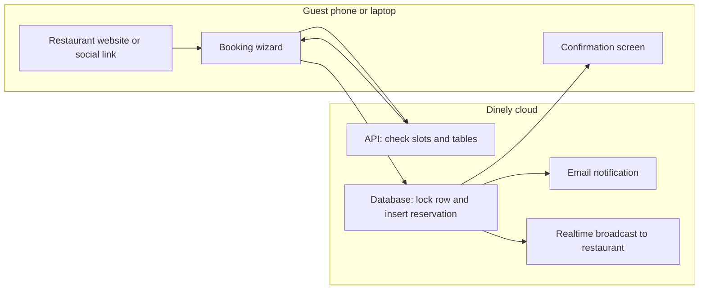
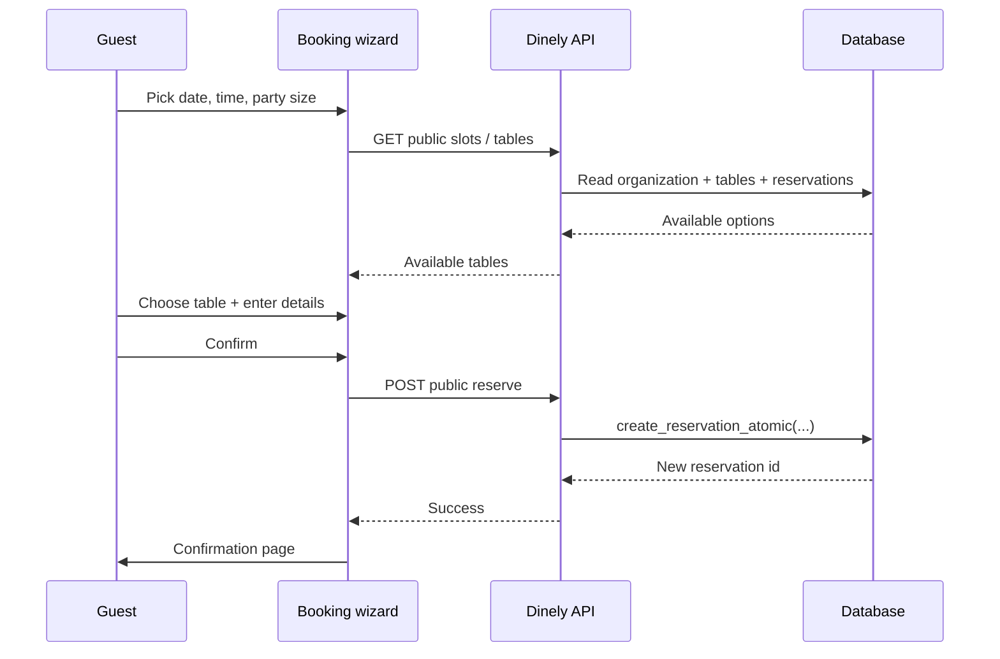
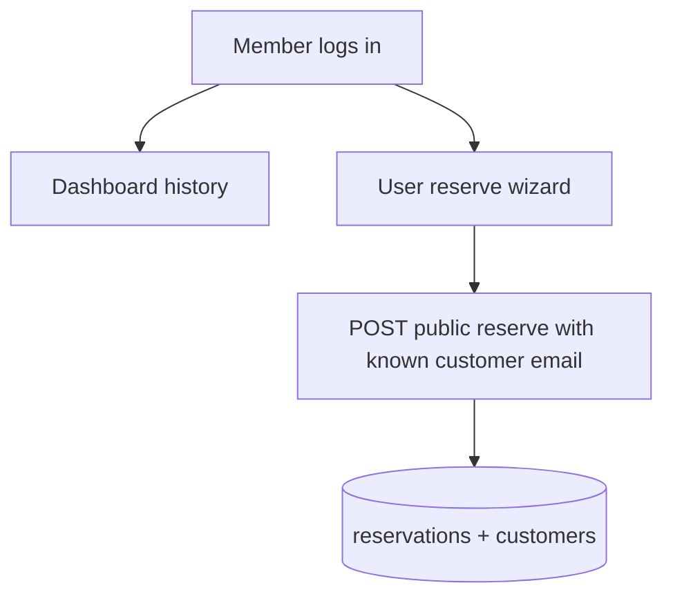

# Dinely — Customer and guest handover guide

**Audience:** Restaurant leadership and guest-experience leads (no technical background required).

This guide explains **what guests and members experience** when they reserve a table, what the system guarantees, and how that connects to the database and booking logic at a plain-English level.

---

## 1. Who is “the customer” in this system?

| Person | Typical login | Main screens |
|--------|----------------|--------------|
| **Anonymous guest** | None | Public booking wizard, confirmation, optional cancel link |
| **Registered member** | Email + password | “User” booking wizard, member dashboard, history |
| **Premium (VIP) member** | Same as member | Premium booking flow; priority rules in the reservation engine |

Staff and admin use **different URLs** and are covered in the Admin and Staff handover guides.

---

## 2. Big picture: from click to locked table

**What “locked table” means:** When the guest confirms, the system writes a row in the `reservations` table for a specific `table_id`, date, and time range. A PostgreSQL routine (`create_reservation_atomic`) locks that table row briefly, checks that no other active reservation overlaps the same time window, then inserts the booking. Two people cannot complete conflicting bookings for the same table at the same instant.

---

## 3. Public booking (no account)

### 3.1 How the guest reaches the wizard

Typical URLs (replace `your-domain` and `your-restaurant-slug` with yours):

- Path style: `https://your-domain/book-a-table/your-restaurant-slug`
- Query style: `https://your-domain/book-a-table?restaurant=your-restaurant-slug`

Optional: send the guest back to your site after booking using `return_url` or `origin` query parameters (handled in `BookATableWizard`).

### 3.2 Steps the guest sees

The public wizard (`src/pages/public-reservation/BookATableWizard.tsx`) reuses the same step components as the logged-in flow:

1. **Date and time** — Loads available time patterns from the public API (`/public/:slug/slots` and related checks used by step components).
2. **Choose table** — Only tables that fit party size and are free for that slot appear (`/public/:slug/availability`, `/public/:slug/tables`).
3. **Contact details** — Name, email, phone, special requests.
4. **Review** — Guest confirms details.
5. **Payment step (only if the restaurant charges a table fee)** — If a fee applies, an extra payment step appears (4 steps become 5).

On final confirm, the browser calls:

`POST /public/:slug/reserve`

with party size, table, guest fields, and `source: 'website'`.

### 3.3 What gets stored

- **Organization:** The reservation is always tied to one restaurant (`restaurant_id` on `reservations`).
- **Table:** `table_id` links to `tables`.
- **Guest identity:** If an email is provided, the system finds or creates a row in `customers` so future visits can be linked.
- **Status:** New bookings from the widget are stored as active reservations (the atomic function sets `confirmed` at creation time in the migration logic you deployed).

### 3.4 Cancelling as a guest

Guests may use a **cancel** flow tied to a specific reservation id (route `/cancel/:reservationId` in the app). The public API supports cancellation with a reason (`POST /public/reservations/:id/cancel` in `public.routes.ts`). This updates the reservation so the table can become bookable again for that window.

---

## 4. Registered members

Members sign up through the customer signup route (`/customer-signup` or slug-scoped variant) and log in for a personalized experience.

**Member booking** uses `UserReservationWizard` (`/user-reserve` or `/user-reserve/:slug`). The final API call is still the public reserve endpoint in the current implementation, but the guest is a known customer with history.

**Member dashboard** (`/dashboard`) shows upcoming and past reservations across restaurants that use the platform.

---

## 5. Premium (VIP) members and priority

The business rules documented in `member_guide.md` and `customer_booking_guide.md` are implemented at database level in `create_reservation_atomic` (see `backend/migrations/003_update_atomic_reservation.sql`):

- When a **new** booking is from a premium customer (`is_vip` on `customers`, passed as `p_is_premium`), and there is a time conflict with an **existing** reservation whose customer is **not** VIP, the function may **cancel the existing reservation** with reason text such as “Bumped by Premium Member Priority”, then insert the VIP booking.
- If the conflicting reservation is already tied to another VIP, the new booking receives an error instead (“table no longer available”).

**Plain English for the client:** VIP is a powerful lever. Use it only if it matches your brand promise, and train staff so they can explain rare “bumped” emails to guests.

---

## 6. Concurrency and fairness

If two guests try to take the **same table at the same time**, the database serializes those attempts on the `tables` row (`FOR UPDATE`). The first completed insert wins; the second receives an error and the wizard shows a failure message so the guest can pick another time or table.

---

## 7. Visual design notes (guest-facing)

- The public wizard uses a **dark theme** layout: full-height background `#0B1517`, card surface `#101A1C`, accent gold `#C99C63`, green progress accents `#6B9E78`, with restaurant **logo** and optional **widget heading / CTA** text pulled from `GET /public/:slug/info`.
- Optional **widget background image** and copy can be configured by the restaurant admin in Settings so the booking page matches your brand.

---

## 8. Glossary

| Term | Meaning |
|------|---------|
| **Slug** | Short unique name for the restaurant in URLs (column `organizations.slug`). |
| **Slot** | A bookable date + time combination derived from opening hours, default visit length, and existing reservations. |
| **Atomic reservation** | Database-backed operation that prevents double booking for the same table and window. |
| **Broadcast** | A lightweight “ping” so all open staff/admin browsers refresh when a reservation changes. |

---

## Related documents

- [`CLIENT_HANDOVER_PHASES.md`](./CLIENT_HANDOVER_PHASES.md) — how documentation was phased.
- [`CLIENT_HANDOVER_ADMIN_AND_OWNER.md`](./CLIENT_HANDOVER_ADMIN_AND_OWNER.md) — how admins expose tables and branding to guests.
- [`CLIENT_HANDOVER_STAFF_OPERATIONS.md`](./CLIENT_HANDOVER_STAFF_OPERATIONS.md) — what happens after the guest books.
