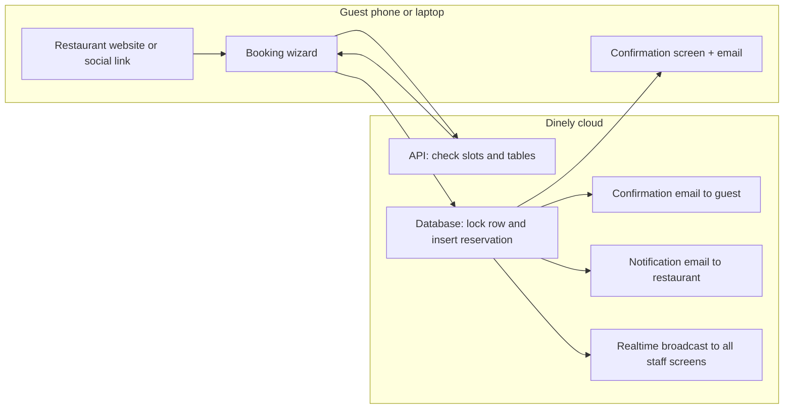
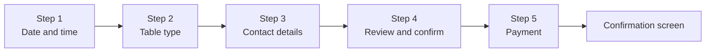
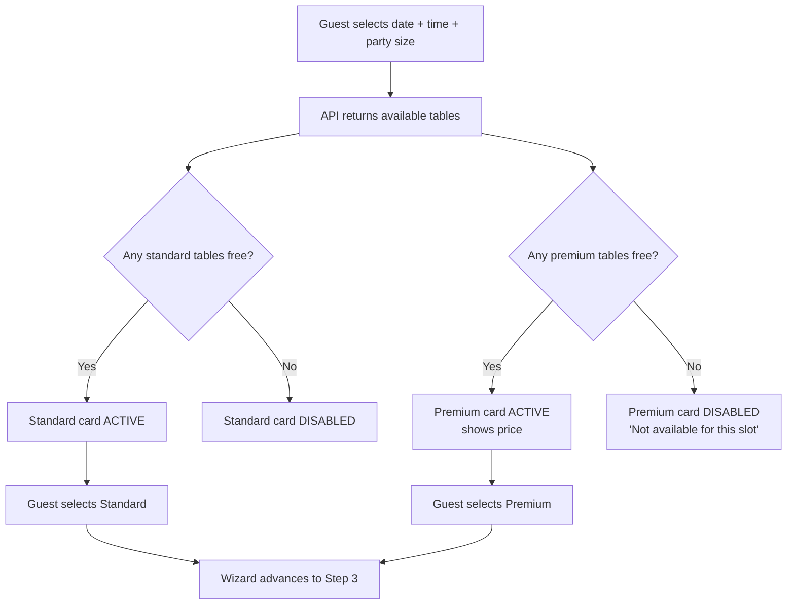
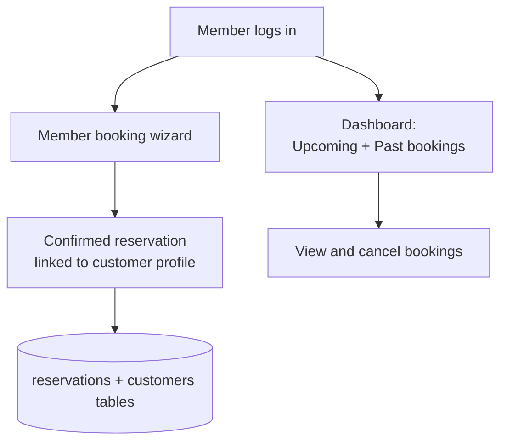
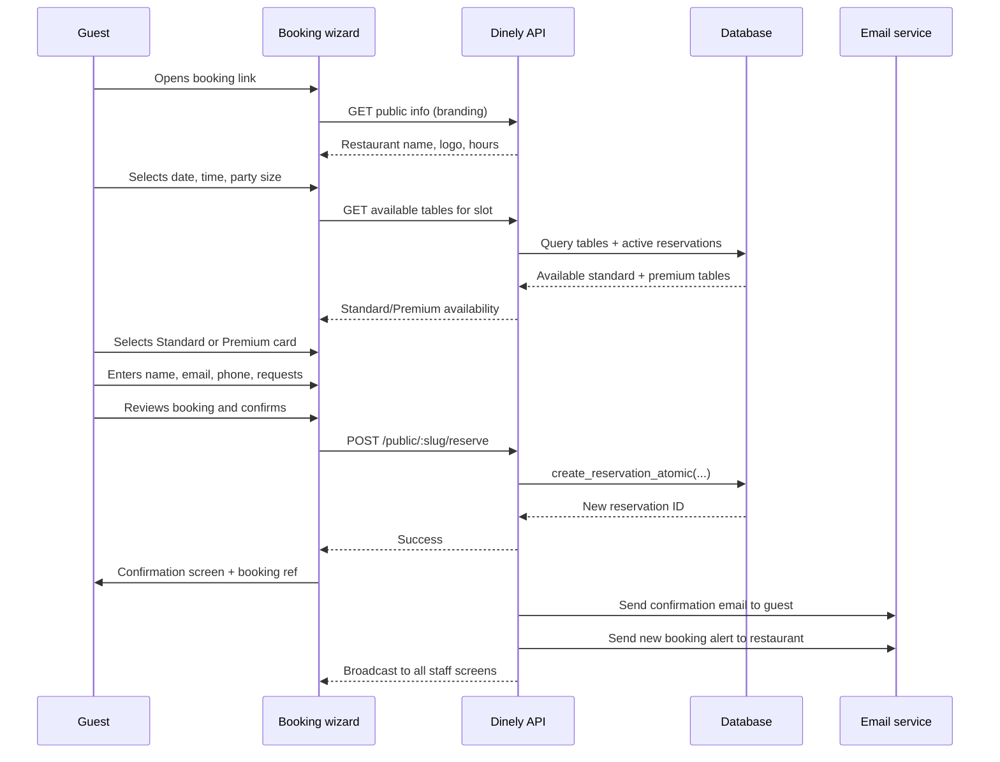

# Dinely — Customer and Guest Handover Guide

**Audience:** Restaurant leadership and guest-experience leads (no technical background required).

This guide explains **what guests and members experience** when they reserve a table, what the system guarantees, and how that connects to the database and booking logic — explained in plain English.

---

## 1. Who is "the customer" in this system?

| Person | Typical login | Main screens |
|--------|----------------|--------------|
| **Anonymous guest** | None | Public booking wizard, confirmation page, optional cancel link |
| **Registered member** | Email + password | Member booking wizard, member dashboard, booking history |
| **Premium (VIP) member** | Same as member | Premium booking flow; priority rules in the reservation engine |

Staff and admin use **different URLs** and are covered in the Admin and Staff handover guides.

---

## 2. Big picture: from click to locked table



**What "locked table" means:** When the guest confirms, the system writes a row in the `reservations` table for a specific table, date, and time range. A PostgreSQL routine (`create_reservation_atomic`) briefly locks that table row, checks no other active reservation overlaps the same window, then inserts the booking. Two people cannot complete conflicting bookings for the same table at the same instant.

---

## 3. Public booking (no account required)

### 3.1 How the guest finds the booking page

Your restaurant has a unique short name called a **slug** (for example, `the-golden-fork`). The booking page URL is:

```
https://app.dinely.co.uk/book-a-table/the-golden-fork
```

Share this link on your website, Instagram bio, Google Business profile, or anywhere guests might look. Optional: add `?return_url=https://your-website.com` so after booking the guest is redirected back to your site.

### 3.2 The five booking steps

The public wizard walks the guest through five steps. Steps 1–4 are always shown; Step 5 only appears if your restaurant charges a reservation fee.



---

#### Step 1 — Date, time, and party size

The guest selects:
- **Date** using a calendar view
- **Party size** using a number stepper (bounded by your configured maximum party size)
- **Preferred time** from a list of available slots

Available slots are calculated live from your **opening hours**, your **default reservation duration**, and how many existing bookings already occupy each table. Slots disappear automatically as tables fill up.

---

#### Step 2 — Choose a table type (Standard or Premium)

This is one of the most important guest-facing screens. Rather than exposing a confusing list of individual table numbers, the system shows the guest exactly **two clear cards**:

```
┌─────────────────────────┐   ┌─────────────────────────┐
│   🪑  Standard Table    │   │   👑  Premium Table      │
│                         │   │                         │
│  5 tables available     │   │  From £25               │
│  Seats 2–6 guests       │   │  3 tables available     │
│                         │   │  Seats 2–8 guests       │
│   [ Select ]            │   │   [ Select ]            │
└─────────────────────────┘   └─────────────────────────┘
```

**Standard Table card:**
- Shows how many standard tables are available for the chosen time and party size
- Shows the capacity range (e.g., "Seats 2–6")
- Selectable when at least one standard table is free; greyed out and disabled if none are available

**Premium Table card:**
- Shows the starting price (e.g., "From £25") pulled from each premium table's configured price
- Shows how many premium tables are available
- When **no premium tables are free** for the chosen slot, the card shows an amber notice: **"Not available for this time slot"** and is disabled — the guest cannot select it
- Carries a **reservation fee** through to the payment step when selected

**What happens when the guest selects a card:** The system automatically assigns the most suitable individual table from that category (matching party size and availability). The guest never sees table numbers — they just choose the type.

**How to configure Standard vs Premium:** In your Admin dashboard under **Tables Management**, any table can be marked as premium and given a price. Tables not marked premium appear in the Standard pool. See the Admin guide for details.



---

#### Step 3 — Contact details

The guest enters:
- First name, last name
- Email address
- Phone number
- Special requests (dietary needs, celebrations, accessibility, etc.)

This information is stored on the reservation. If the email matches an existing customer profile, the booking is linked to that customer's history automatically.

---

#### Step 4 — Review and confirm

A summary screen showing the full booking details. The guest confirms or goes back to correct anything. On confirm, the booking is locked in the database.

---

#### Step 5 — Payment (only if a reservation fee applies)

If the guest selected a **Premium Table** (which has a fee) or if your restaurant applies a standard reservation fee, this step appears. Payment is handled via **Stripe** — guest card details go directly to Stripe's secure servers and never touch Dinely's database.

After successful payment, the booking is confirmed and the fee is recorded against the reservation.

---

### 3.3 Confirmation screen and emails

After successful booking:
1. The guest sees a **confirmation screen** with their booking reference number.
2. The guest receives a **confirmation email** with booking details, the restaurant's address, and a **cancellation link**.
3. Your restaurant receives a **new booking notification email** at the contact address configured in Settings.
4. All open **staff screens update in real-time** so floor staff can prepare immediately.

### 3.4 What gets stored in the database

Each completed reservation is one row in the `reservations` table:

| Field | What it holds |
|-------|---------------|
| `restaurant_id` | Which restaurant owns this booking |
| `table_id` | The specific table assigned (standard or premium) |
| `reservation_date` | The date of the visit |
| `start_time` / `end_time` | Time window the table is blocked |
| `party_size` | Number of guests |
| `guest_first_name` / `guest_last_name` | Guest name |
| `guest_email` / `guest_phone` | Contact details |
| `special_requests` | Any notes entered |
| `status` | `confirmed` at creation; changes as the visit progresses |
| `source` | `website` for public bookings |
| `customer_id` | Links to the customer profile if the email was recognised |

### 3.5 Cancelling as a guest

Every confirmation email contains a **Cancel this reservation** link. Clicking it takes the guest to a cancellation screen where they confirm they want to cancel. The reservation is updated in the database and the table slot immediately becomes bookable again for other guests.

The cancellation link is tied to the specific reservation ID and does not require the guest to create an account.

---

## 4. Registered members

Members who sign up for a Dinely account get a personalised experience.

### 4.1 Signing up

Guests sign up at `/customer-signup` (or a slug-scoped variant for a specific restaurant). They set an email and password. A customer profile is created.

### 4.2 Member booking wizard

The member booking flow is identical to the public flow in appearance but the member is authenticated. Their contact details are pre-filled automatically. The booking is linked to their customer profile so it appears in their history.

### 4.3 Member dashboard

At `/dashboard` members see:
- **Upcoming reservations** across any restaurant using Dinely
- **Past booking history**
- Ability to cancel upcoming bookings from one screen



---

## 5. Premium (VIP) members and priority booking

The system supports a **VIP membership** tier for high-value customers.

**How VIP priority works (for your information):**
When a VIP member requests a table that has an overlapping booking from a non-VIP guest, the database routine can automatically **cancel the non-VIP booking** and award the slot to the VIP member. The bumped guest receives a cancellation email.

If the conflicting booking is also from a VIP, the system does **not** bump — instead it tells the new VIP the table is unavailable.

**Plain English advice:** VIP bumping is a powerful feature. Only enable it if your brand promises consistently guarantee premium members priority access. Inform your team so they can handle any rare phone calls from bumped guests graciously.

VIP status is set by an admin on the customer's profile in the **Customers** section of the admin dashboard.

---

## 6. Concurrency and double-booking protection

If two guests try to book the **same table at the same time** (for example, two people both clicking "Confirm" within milliseconds of each other), the database handles this safely:

1. The first completed request wins and the booking is created.
2. The second request hits the database lock and gets an error: "table no longer available."
3. The second guest sees a failure message in the wizard and can choose a different time or table.

This is handled by `create_reservation_atomic` — a PostgreSQL function that uses row-level locking to ensure no two bookings can ever be written for the same table and overlapping window at the same instant.

---

## 7. Appearance and branding

The public booking wizard uses your restaurant's visual identity pulled from Settings:

| Setting | Where it appears |
|---------|-----------------|
| **Logo** | Top of the booking wizard |
| **Widget heading** | Large headline text on the first step |
| **Widget CTA text** | Button or subtitle copy |
| **Widget background image** | Background of the wizard |
| **Brand colour** | Accent colour (optional) |

All of these are configurable by the admin in **Settings → Branding** without any developer involvement.

The wizard always uses a **dark, elegant theme** (`#0B1517` background, `#C99C63` gold accent) that works across all restaurant types.

---

## 8. Complete guest journey at a glance



---

## 9. Glossary

| Term | Meaning |
|------|---------|
| **Slug** | Short unique name for the restaurant in URLs (e.g., `the-golden-fork`). |
| **Slot** | A bookable date + time combination derived from opening hours, visit duration, and existing bookings. |
| **Standard Table** | Any table not marked as premium — the default pool available to all guests. |
| **Premium Table** | A table marked premium by the admin, carrying a higher fee and shown as a separate category to guests. |
| **Atomic reservation** | Database operation that prevents double booking for the same table and window — all or nothing. |
| **Broadcast** | A lightweight instant signal sent to all open staff and admin browsers when a reservation is created or changed. |
| **Customer profile** | A record in the `customers` table that links a guest's email to all their past and upcoming bookings. |
| **VIP / Premium member** | A customer with elevated priority; may be granted the ability to bump non-VIP bookings. |

---

## Related documents

- [`CLIENT_HANDOVER_PHASES.md`](./CLIENT_HANDOVER_PHASES.md) — how documentation was phased.
- [`CLIENT_HANDOVER_ADMIN_AND_OWNER.md`](./CLIENT_HANDOVER_ADMIN_AND_OWNER.md) — how admins configure tables, branding, and guest policies.
- [`CLIENT_HANDOVER_STAFF_OPERATIONS.md`](./CLIENT_HANDOVER_STAFF_OPERATIONS.md) — what happens after the guest books.
