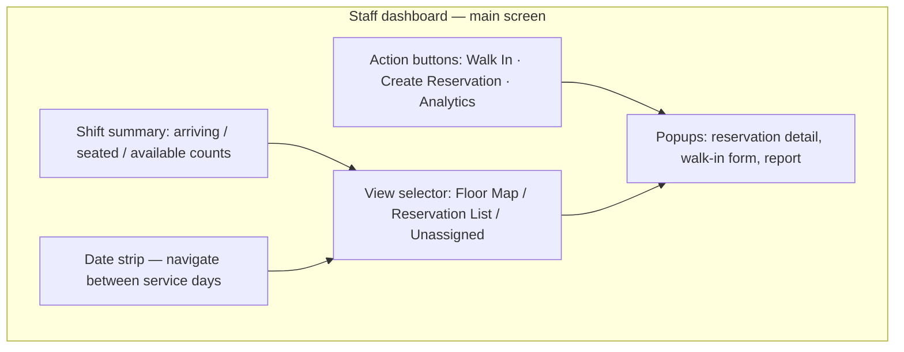
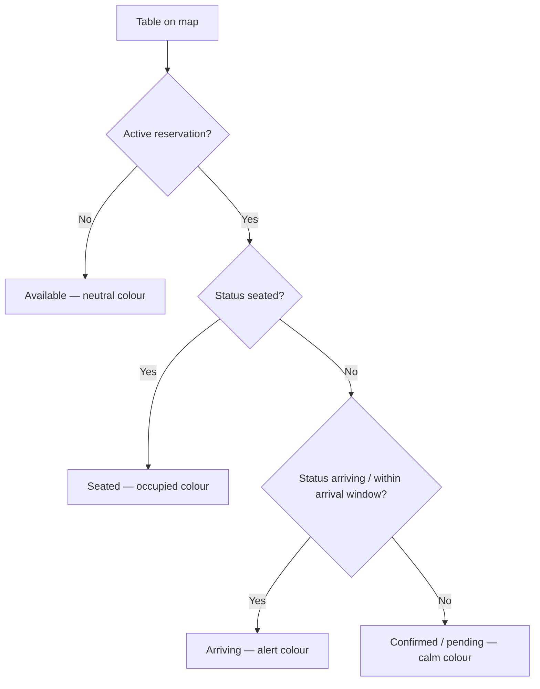
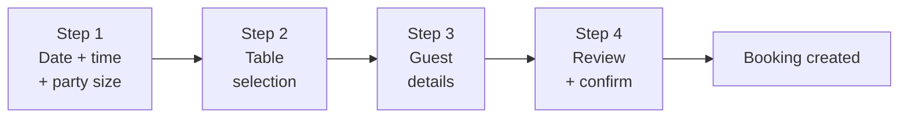
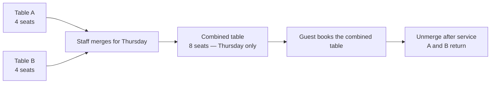

# Dinely — Staff Operations Handover Guide

**Audience:** Hosts, servers, floor managers, and anyone using the **Staff Dashboard** during service.

This document explains **what staff see on screen**, **which actions to take during service**, and **how those actions connect to reservations in the database** — in plain English.

---

## 1. Getting to the right place

Staff use slug-scoped URLs so the system knows which restaurant they belong to:

| Action | URL pattern |
|--------|-------------|
| Staff login | `/staff-login/{restaurant-slug}` |
| Staff workspace | `/staff/{restaurant-slug}/tables` |

The restaurant admin can copy these exact links from **Settings** and share them with the team.

**Optional security:** If the admin enabled **Staff IP Login** in Settings, the login page only accepts connections from trusted IP addresses (e.g., the restaurant's Wi-Fi). This prevents unauthorised access from outside the premises.

---

## 2. Staff roles and what each can do

The system has several staff roles. The admin assigns a role when inviting each team member.

| Capability | Viewer | Host | Manager | Admin |
|-----------|--------|------|---------|-------|
| View reservation list and floor map | ✓ | ✓ | ✓ | ✓ |
| Update reservation status (seat, complete, no-show) | — | ✓ | ✓ | ✓ |
| Create reservations and walk-ins | — | ✓ | ✓ | ✓ |
| Merge and unmerge tables | — | ✓ | ✓ | ✓ |
| View Analytics Report | — | — | ✓ | ✓ |
| Manage tables and settings | — | — | — | ✓ (admin dashboard) |

---

## 3. The Staff Table Management screen

After login, staff land on the main operations console (`StaffTableManagement`). This is the hub for everything that happens during a service.



**Realtime updates:** All open staff browsers subscribe to the restaurant's live channel. When a guest books online, or another staff member changes a status, every screen updates automatically — no manual refreshing needed.

---

## 4. The shift summary bar

At the top of the screen, four numbers update continuously:

| Number | What it means |
|--------|---------------|
| **Arriving** | Reservations within the upcoming arrival window |
| **Seated** | Parties currently at a table |
| **Available** | Tables with no active reservation right now |
| **Total** | All reservations for the selected service day |

---

## 5. Navigating by date

The **date strip** at the top lets staff jump between days. By default it shows today. When you switch to a different date (e.g., checking tomorrow's bookings or setting up a future merge), the reservation list and floor map update to reflect that day.

---

## 6. Floor map views

The interactive floor map shows each table as a coloured card or circle positioned to match the physical dining room layout. Colours reflect live status:



Clicking any table on the map opens the **reservation detail** popup for that table, where staff can update status or view guest information.

**Floor areas:** If the restaurant has multiple sections (e.g., Main Room, Terrace, Bar), staff can filter the map by area using the area tabs above the map.

---

## 7. Reservation list view

Alongside the floor map, the **list view** shows all reservations for the selected day in time order. Each row shows:
- Guest name
- Party size
- Time slot
- Table number
- Current status
- Source (walk-in, online, phone, etc.)

Clicking a row opens the same reservation detail popup.

---

## 8. Reservation detail and status actions

When a reservation is opened (via the map or list), a detail panel shows all guest information and action buttons. Staff can advance the reservation through its lifecycle:

```mermaid
stateDiagram-v2
  [*] --> confirmed: Guest books online or staff creates
  confirmed --> arriving: Staff marks guest as on the way
  arriving --> seated: Guest is seated at the table
  seated --> completed: Meal finished; table cleared
  confirmed --> no_show: Guest did not arrive
  confirmed --> cancelled: Guest or staff cancels
  completed --> [*]
  no_show --> [*]
  cancelled --> [*]
```



| Status | When to use | Effect |
|--------|-------------|--------|
| **Arriving** | Guest contacted to say they're on the way | Highlights the table on the map |
| **Seated** | Guest is physically seated | Marks table as occupied; blocks online booking for that window |
| **Completed** | Party has left; table is cleared | Frees the table for future bookings |
| **No-show** | Guest never arrived after reasonable wait | Frees the table; records in the guest's history |
| **Cancelled** | Booking cancelled by guest or staff | Table immediately available again |

**Why this matters:** The online booking engine reads live reservation statuses. If a party finishes early but the status is not moved to `completed`, the table still appears blocked to online guests. Always complete reservations promptly.

---

## 9. Walk-in seating

Walk-ins are guests who arrive without a prior booking. The **Walk In** button (outlined gold, beside the Create Reservation button) opens a fast single-screen modal designed for front-of-house speed.

### 9.1 Opening the Walk-in Modal

Click the **"Walk In"** button (shows a person + check icon). The modal opens with:
- **Date** pre-set to today
- **Time** pre-set to the current time (rounded down to the nearest 15 minutes)
- **Party size** defaulting to 2

If the day has been marked as closed by the admin, the button is disabled with an explanatory message.

### 9.2 The Walk-in form

All fields are visible at once — no multi-step wizard. The layout:

```
┌─────────────────────────────────────────────────────┐
│  Walk-In Seating                                [X] │
├─────────────────────────────────────────────────────┤
│  Party Size [- 2 +]          Date [2026-05-16]      │
│  Time [14:30]                                       │
│                                                     │
│  Available Tables:                                  │
│  [T12 · 4 seats]  [T15 · 6 seats]  [T8 · 4 seats]  │
│                                                     │
│  First Name (optional)    Last Name (optional)      │
│  Phone (required)         Email (optional)          │
│  Special Requests...                                │
│                                                     │
│  [Cancel]                     [Seat Walk-in  →]     │
└─────────────────────────────────────────────────────┘
```

### 9.3 Available tables refresh automatically

When the party size, date, or time changes, the **available tables list updates instantly** — pulling from the same availability API used by the online booking widget. Only tables with enough capacity that are not blocked by another reservation appear. If no tables are free, an amber warning shows.

### 9.4 Submitting the walk-in

Click **"Seat Walk-in"** to:
1. Create the reservation in the database with `source: walk_in`
2. Immediately mark it as `seated`
3. Close the modal and refresh the floor map — the table turns to seated colour instantly

A confirmation message appears: _"Walk-in seated at Table T12"_

**Why the two-step approach:** The reservation system creates a confirmed booking first (to lock the table in the database), then instantly promotes it to seated. This ensures the atomic lock is applied before the status change, preventing any race condition.

### 9.5 Why entering walk-ins matters

If walk-ins are not recorded, the online booking engine thinks the table is free and may **double-sell** it to a guest booking online. Always enter walk-ins — even approximate details — so the system accurately reflects what is happening on the floor.

```mermaid
sequenceDiagram
  participant G as Walk-in guest
  participant S as Staff
  participant UI as Walk-in modal
  participant API as Backend

  G->>S: Arrives and asks for a table
  S->>UI: Opens Walk-in modal
  UI->>API: GET available tables (party size + time)
  API-->>UI: List of free tables
  S->>UI: Selects table, enters guest phone
  S->>UI: Clicks Seat Walk-in
  UI->>API: POST create reservation (source: walk_in)
  API-->>UI: Reservation created
  UI->>API: PATCH status → seated
  API-->>UI: Status updated
  UI-->>S: Success toast; map refreshes
  Note over UI: Floor map shows table as seated
```

---

## 10. Creating staff reservations (phone bookings)

The **"Create Reservation"** button (filled gold button) opens the staff reservation wizard — a 4-step form for entering bookings taken by phone or any channel other than the online widget.



- **Step 1:** Choose date, time slot, and party size. Slot availability is checked live.
- **Step 2:** Full table list with capacities — staff can pick any available table.
- **Step 3:** Guest name, email, phone, special requests.
- **Step 4:** Review all details and confirm. Booking is created with `source: pos` (point-of-sale / staff-created).

Staff-created reservations bypass online booking restrictions (e.g., advance booking window limits) because authenticated staff are trusted to make judgement calls.

---

## 11. Table merge (large parties)

When a single table is not large enough, adjacent tables can be **merged** into one combined unit.

**Precondition:** The restaurant admin must have enabled **Allow Mergeable Tables** in Settings, and the individual tables must be marked as mergeable.

**How to merge:**

1. Use the **date strip** to navigate to the service day the merge is needed for.
2. Enter merge mode — the UI explains the keyboard shortcut (Shift+Click) to multi-select tables.
3. Select two or more mergeable tables.
4. Enter a label for the combined table (e.g., "Party of 14") and confirm.

**Date-aware behaviour:** The merge is tied to the day you selected. On other days, the individual tables function normally. Online booking for the merge day immediately shows the combined table.

**Unmerge:** When the party leaves, click **Unmerge & Restore Tables** so the individual tables return for normal service.



---

## 12. Unassigned reservations

The **"Unassigned"** view tab shows bookings that exist for the day but do not yet have a specific table assigned. This happens when:
- A guest booked online and the table assignment step was skipped or needs review
- A booking was created by phone without specifying a table

The host should assign these before service starts so the floor map is accurate and no table is double-sold.

---

## 13. Analytics Report (managers and admins only)

The **"Analytics"** button appears in the top toolbar for staff with **Manager** or **Admin** role. It opens a full-screen report covering all reservation activity for a chosen period.

### 13.1 Period selector

```
[Daily]  [Weekly]  [Bi-weekly]  [Monthly]    Date: [2026-05-16]    [Refresh]
```

Select a period and optionally pick a reference date (defaults to today). Click **Refresh** to load. The report recalculates the date range automatically:

| Period | Date range |
|--------|-----------|
| Daily | The selected single day |
| Weekly | 7 days ending on the selected date |
| Bi-weekly | 14 days ending on the selected date |
| Monthly | The full calendar month of the selected date |

### 13.2 Summary cards

Five headline numbers at the top:

| Card | What it shows |
|------|---------------|
| **Total Bookings** | All reservations in the period (all statuses) |
| **Total Covers** | Sum of all party sizes — the total number of guests served |
| **Walk-ins** | Reservations with source `walk_in` |
| **Online** | Reservations booked via the public widget or app |
| **Staff / Phone** | Reservations created by staff (POS or phone source) |

### 13.3 Breakdown charts

**Source breakdown:** Percentage bars showing the split between Walk-in, Online, Staff/POS, and Phone bookings.

**Status breakdown:** Percentage bars showing Completed, Seated, Confirmed, Arriving, Cancelled, and No-show counts.

### 13.4 Daily trend table

A compact table showing for each day in the period:
- Total reservations
- Total covers (guests)
- Walk-in count
- Online count
- Staff-created count

### 13.5 Full reservation detail table

A scrollable table showing every individual reservation in the period with:
Date · Time · Guest Name · Phone · Email · Party Size · Table · Source · Status · Special Requests

### 13.6 Export and print

**Export CSV:** Downloads a spreadsheet-compatible file named `dinely-report-{period}-{dates}.csv`. Opens cleanly in Microsoft Excel or Google Sheets. Covers the same date range as the on-screen report.

**Print / Save PDF:** Opens the browser print dialog. The report automatically formats for print — the overlay chrome, buttons, and controls are hidden, and the full report appears on a clean white background with the restaurant name, period, and generation timestamp at the top. Use "Save as PDF" in the print dialog to create a PDF file.

---

## 14. Guest contact information

Staff can see guest contact fields from the reservation: first name, last name, email, and phone number. This allows phone confirmation calls or follow-ups. Internal notes (when present) are visible only to staff and are not shown to guests.

---

## 15. Reliability tips for shifts

- Keep **one primary device** per host stand logged in. Multiple devices are supported but every device should follow the same status discipline.
- If the map looks stale, **refresh once** — the realtime channel reconnects automatically on page load.
- At **shift handover**, glance at tables still showing `seated` — either guests are still dining or a previous shift forgot to mark `completed`.
- Walk-ins **must** be entered promptly — a table that is physically occupied but shows as "available" in the system can cause an online double-booking.
- If the **Walk In** or **Create Reservation** button is greyed out, the admin has marked that day as closed. Contact the manager to adjust if needed.

---

## 16. Staff vs admin powers at a glance

| Capability | Staff dashboard | Admin dashboard |
|------------|-----------------|-----------------|
| Live floor map and status updates | ✓ | ✓ (in Reservation tab) |
| Create reservations and walk-ins | ✓ | ✓ |
| View Analytics Report (manager+) | ✓ | ✓ |
| Table merge and unmerge | ✓ | — |
| Invite or remove staff | — | ✓ |
| Edit tables, floor areas, capacities | — | ✓ |
| Change organization settings | — | ✓ |
| View waiting list | — | ✓ |

Staff login tokens include the restaurant scope — the backend's role checks (`requireMinRole`) block any attempt to access admin-only routes from the staff portal.

---

## Related documents

- [`CLIENT_HANDOVER_PHASES.md`](./CLIENT_HANDOVER_PHASES.md)
- [`CLIENT_HANDOVER_CUSTOMER_AND_GUEST.md`](./CLIENT_HANDOVER_CUSTOMER_AND_GUEST.md) — the guest's booking journey
- [`CLIENT_HANDOVER_ADMIN_AND_OWNER.md`](./CLIENT_HANDOVER_ADMIN_AND_OWNER.md) — admin setup and management
- [`staff_guide.md`](./staff_guide.md) — shorter quick-reference checklist version
