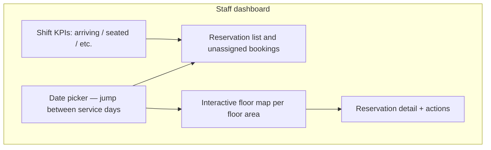
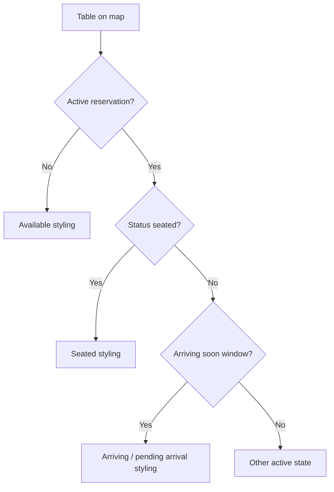
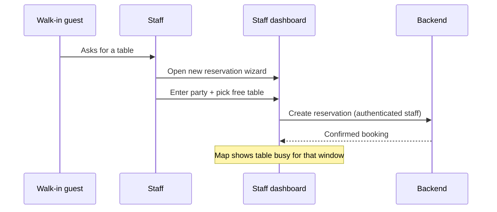
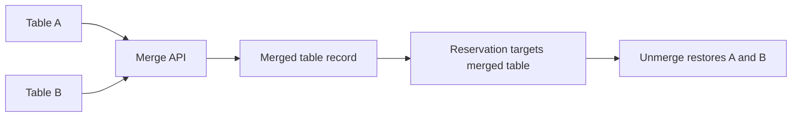

# Dinely — Staff operations handover guide

**Audience:** Hosts, servers, floor managers, and anyone using the **Staff Dashboard** during service.

This document explains **what staff see on screen**, **which actions to take during service**, and **how those actions connect to reservations in the database**.

---

## 1. Getting to the right place

Staff should always use the **slug-scoped** URLs so the system knows which restaurant they belong to:

| Action | URL pattern |
|--------|-------------|
| Staff login | `/staff-login/{restaurant-slug}` |
| Staff workspace | `/staff/{restaurant-slug}/tables` |

Helpers live in `src/utils/restaurantRoutes.ts`. Admins can copy exact links from **Settings**.

**Optional security:** If the restaurant enabled **staff IP login** in admin Settings, logins may only work from addresses on the trusted list (configured on `organizations`).

---

## 2. After login: the Staff Table Management screen

Primary component: `StaffTableManagement.tsx` — this is the **live operations console**.

High-level layout:

**Realtime:** Like the admin dashboard, staff subscribe to `restaurant_{restaurantId}` broadcasts. When a guest books online, the new reservation and table colouring can update without refreshing.

---

## 3. How table colours map to reality

The map derives a **visual status** per table by looking at active reservations (`status` not in `completed`, `cancelled`, `no_show`). Priority roughly:

1. **Seated** — Someone is physically dining; map shows seated styling.
2. **Arriving / pending arrival** — A booking is within the configured arrival window (soon) or marked `arriving`.
3. **Available** — No blocking reservation for the viewed time context.

Exact colours are defined in `getStatusStyle` in the staff component; they are tuned for both dark and light themes.

---

## 4. Core staff actions (day-of)

### 4.1 Mark a reservation as seated

When guests arrive, select their booking and update status to **`seated`** via `PATCH /organizations/:orgId/reservations/:id/status`.

**Why:** While a reservation is active for a slot, the table is not sold again for overlapping times. Seated is the clearest signal that the party has started their visit.

### 4.2 Complete or clear after the meal

When the party leaves and the table is bussed, move the reservation to **`completed`** (same PATCH endpoint family used throughout the component).

**Effect:** Completed reservations no longer block availability for future bookings in that window.

### 4.3 No-show

If the guest never arrives, **`no_show`** frees your planning view and records the behaviour in data for future service decisions.

### 4.4 Unassign table (rare correction flow)

The code includes logic to return a reservation toward **`confirmed`** while freeing the physical assignment — useful if you seated the wrong party or need to shuffle tables. Use only with manager awareness.

---

## 5. Walk-ins

When **Allow walk-ins** is enabled for the organization, staff can seat guests who did not book online.

Typical pattern:

1. Confirm a physically free table that fits the party.
2. Open **`StaffReservationWizard`** from the staff UI to capture guest details, time, and table.
3. Submit so a `reservations` row is created with an appropriate `source` (for example walk-in / phone variants configured in your deployment).

**Plain English:** If you seat walk-ins but never enter them, the online channel might still think the table is empty and **double-sell** it. Always mirror reality in the app.

---

## 6. Table merge (large parties)

**Precondition:** Admin must enable **allow mergeable tables** at the organization.

**Staff workflow** (implemented in `StaffTableManagement`):

1. Use the **date strip or calendar** so the dashboard matches the day you are merging for (for example, switch to the **16th** before merging for that night’s large party).
2. Enter merge mode (UI explains **Shift+Click** to multi-select tables).
3. Select two or more tables the restaurant allows to combine.
4. Provide a **label** for the combined table and confirm.

**Date-aware behaviour:** The merge is tied to the **day you have selected** on the staff dashboard. On earlier days, the individual tables still appear and can be booked or used for walk-ins. On the merge day (and after, until you unmerge), the floor shows the single combined table. The system can also **materialize** the merge in the database as soon as anyone checks availability for that day, so online booking matches the floor.

**Unmerge:** When the party leaves, use **Unmerge & Restore Tables** so individual tables return for normal service.

---

## 7. Reservations without a table assignment

The list section can show bookings **with no `table_id`**. Those guests are coming, but no specific table is locked yet. The host should **assign or seat** them using your house procedure so the map and online availability stay truthful.

---

## 8. Phone and internal coordination

Staff see guest **contact** fields from the reservation (`guest_email`, `guest_phone`, names). **Internal notes** (when present) are for the team only and are not shown on the public booking wizard.

---

## 9. Staff roles vs admin powers

| Capability | Staff dashboard | Admin dashboard |
|------------|-----------------|-----------------|
| Live map and status changes | Yes | Also visible in admin reservation tab |
| Create on-the-fly reservations | Yes (wizard) | Yes |
| Edit organization settings | No | Yes |
| Invite or delete staff | No | Yes |
| Edit table inventory and merge policy | No | Yes |

Staff JWTs include the restaurant scope; the backend’s RBAC middleware (`requireRole`, `requireMinRole` in `backend/src/middleware/rbac.ts`) blocks under-privileged routes.

---

## 10. Reliability tips for shifts

- Keep one **primary device** per stand logged in; multiple devices are supported but should follow the same status discipline.
- If the map ever looks stale, refresh once — normal operation should recover through broadcasts and polling inside admin; staff views rely heavily on successful websocket subscription to Supabase.
- At handover between shifts, glance for tables still **`seated`** — either guests remain or someone forgot to **`complete`**.

---

## Related documents

- [`CLIENT_HANDOVER_PHASES.md`](./CLIENT_HANDOVER_PHASES.md)
- [`CLIENT_HANDOVER_CUSTOMER_AND_GUEST.md`](./CLIENT_HANDOVER_CUSTOMER_AND_GUEST.md)
- [`CLIENT_HANDOVER_ADMIN_AND_OWNER.md`](./CLIENT_HANDOVER_ADMIN_AND_OWNER.md)
- [`staff_guide.md`](./staff_guide.md) — shorter checklist version
