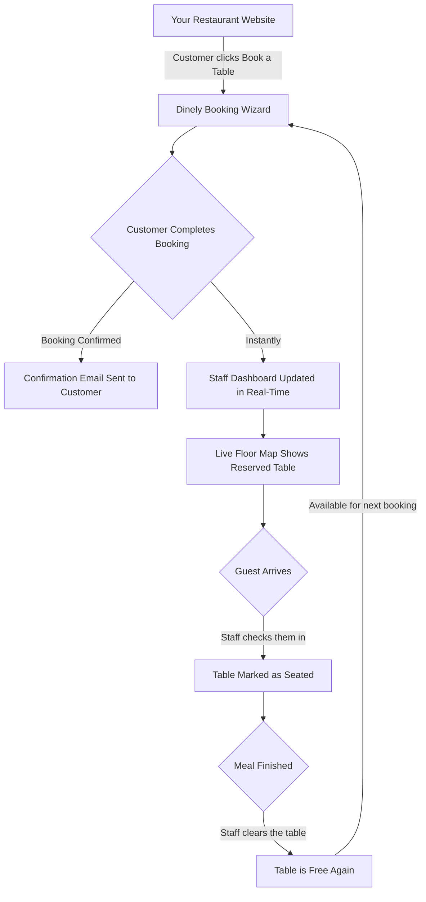
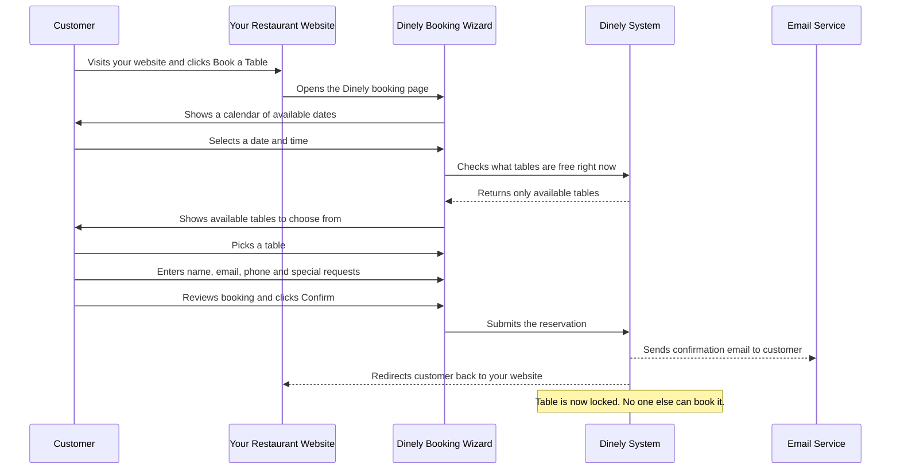
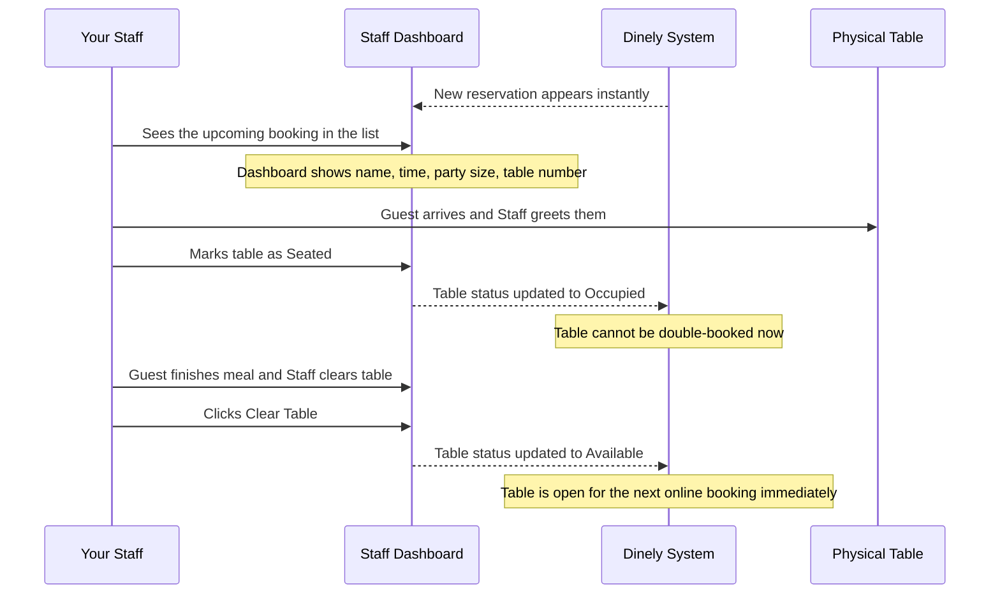
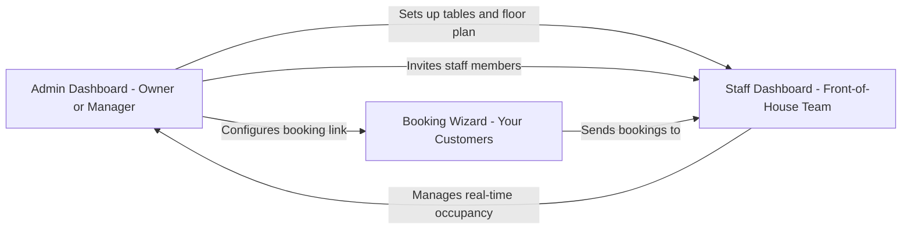
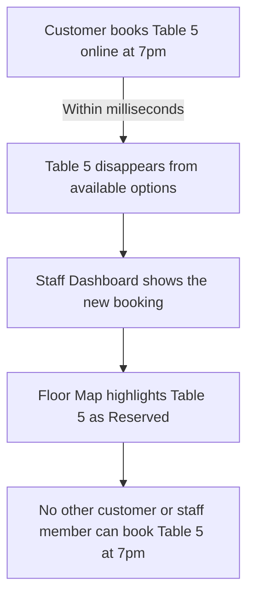

# Dinely — Client Overview

**Welcome to Dinely.** This document is your complete, plain-English guide to understanding what Dinely does, how it works, and how it slots into your restaurant operations. No technical knowledge is needed to read this.

---

## What Is Dinely?

Dinely is a real-time table reservation platform built for restaurants. Think of it as a smart front-desk manager that never sleeps. It handles online bookings from your customers, keeps your staff informed instantly, and ensures no two guests are ever double-booked at the same table.

Your restaurant gets:
- A **booking page** that sits on your own website.
- A **staff dashboard** so your team can see who is coming in, when, and where.
- An **admin dashboard** so the owner or manager can set everything up and manage the whole operation.

---

## The Big Picture

Here is how all the pieces fit together at a glance:



The cycle above is continuous throughout your restaurant's operating hours. Every step happens automatically — your team just needs to interact with the dashboard.

---

## Step-by-Step: How a Customer Makes a Booking

This is what your customer experiences from start to finish.



**What the customer sees:**
1. A clean, 4-step form — Date & Time → Choose Table → Your Details → Confirm.
2. A confirmation screen showing their full booking summary.
3. An email in their inbox with all the details.
4. They are automatically sent back to your restaurant's website.

---

## What Happens on Your Side (The Restaurant)

While the customer is booking, here is what happens inside your operation.



---

## The Three Dashboards Explained

Dinely has three separate areas, each designed for a different person in your team.



| Dashboard | Who Uses It | What They Do |
|---|---|---|
| **Admin Dashboard** | Owner / Manager | Sets up restaurant layout, creates tables, invites staff, views all reservations |
| **Staff Dashboard** | Front-of-house team | Sees today's bookings, checks in guests, tracks table occupancy live |
| **Booking Wizard** | Your customers | Makes a reservation in 4 simple steps from your website |

---

## Real-Time Synchronisation: Why It Matters

The most important feature of Dinely is that everything updates **instantly**, across all devices.



This means:
- **No double bookings.** Ever.
- **No phone calls needed** to check availability. The system knows.
- **No manual updates.** When a table is cleared, it's immediately open for new bookings online.

---

## How the Booking Link Works

Your restaurant gets a unique booking link that you can place anywhere on your website (a button, a banner, a link in your social media bio).

**Example Link Format:**
```
https://dinely.com/book-a-table?restaurant=your-restaurant-name
```

You can also tell Dinely where to send the customer after they book:
```
https://dinely.com/book-a-table?restaurant=your-restaurant-name&return_url=https://yourwebsite.com/thank-you
```

When the customer finishes booking, they are automatically sent back to your page — seamlessly, as if the booking was always part of your site.

---

## Summary: Your Restaurant with Dinely

| | Without Dinely | With Dinely |
|---|---|---|
| **Bookings** | Phone calls only | Online 24/7, any device |
| **Records** | Paper reservation book | Digital, always up to date |
| **Double Bookings** | Risk of human error | Impossible — system prevents it |
| **Staff Awareness** | Word of mouth | Live dashboard for all staff |
| **Guest Confirmation** | Manual or none | Automatic email every time |
| **Table Tracking** | Walk around to check | Live colour-coded floor map |

---

*For setup instructions, see the **Admin Guide**. For daily operations, see the **Staff Guide**.*
