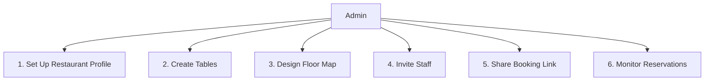
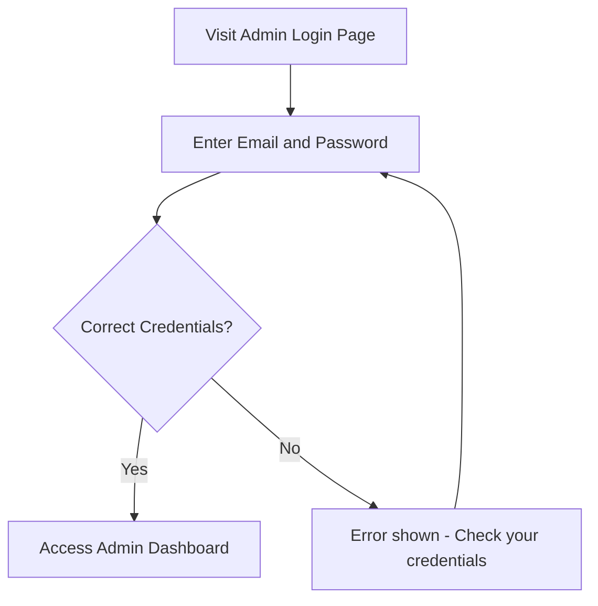
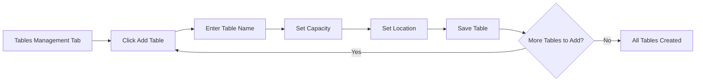
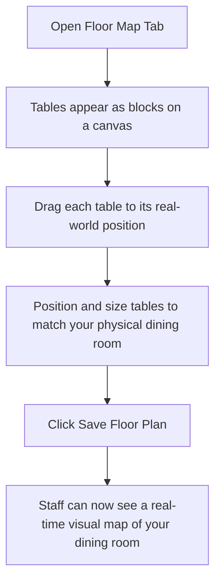
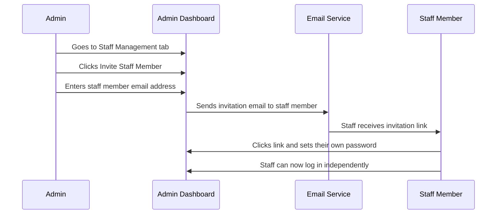
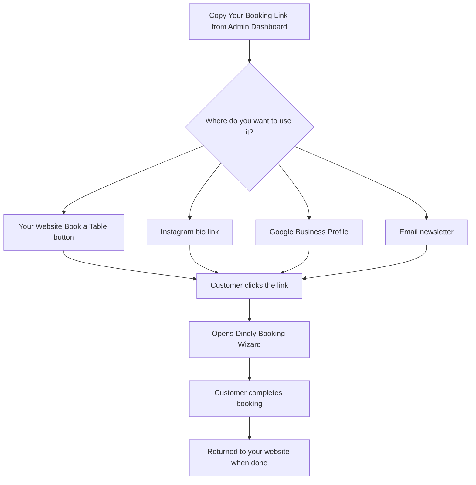
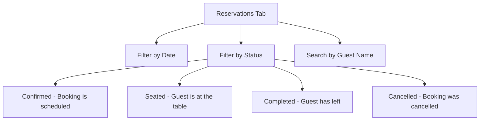
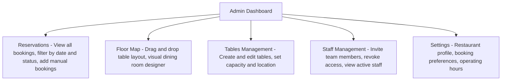

# Dinely — Admin Guide

**Who is this guide for?** This guide is for the restaurant owner or manager — the person who sets up the system and is responsible for the overall configuration. You do not need any technical knowledge to follow this guide.

---

## Your Role as Admin

As an Admin, you are the person in charge. You control everything — from how the tables are laid out to who on your team gets access. Think of this guide as your checklist for getting started and keeping things running smoothly.



---

## Step 1: Logging In

You will receive your login credentials from your Dinely setup. Visit the admin login page and sign in with your email and password.



Once logged in, you land on the **Admin Dashboard** — your central control panel.

---

## Step 2: Creating Your Tables

Before anything can be booked, you need to tell Dinely what tables your restaurant has.

Navigate to **Tables Management** in your dashboard.



**Tips for naming tables:**
- Use names your staff will immediately recognise, like **"Window Seat 1"** or **"Private Room A"**.
- The table name is also shown to customers when they choose their table online, so keep it friendly.
- Group tables by location so staff can quickly filter them on the live dashboard.

---

## Step 3: Designing the Floor Map

Once your tables are created, go to the **Floor Map** tab. This is where you arrange the tables to visually match your actual restaurant layout.



**Why this matters:**
- Your staff's **Live View** mirrors this exact layout. When a table is booked, it changes colour on the map.
- Managers visiting the dashboard can instantly see which section of the restaurant is busy.

| Table Colour on Staff Map | Meaning |
|---|---|
| Green | Available — ready for guests |
| Amber | Reserved — a booking is coming |
| Red | Seated — guests are currently at the table |

---

## Step 4: Inviting Your Staff

Your team needs their own logins to access the Staff Dashboard. You send them invitations — they never need to share your admin credentials.



**Managing your team:**
- You can see all invited staff members and whether they have accepted.
- If someone leaves your team, you can revoke their access instantly.
- Staff can only see their dashboard — they cannot change your table setup or invite others.

---

## Step 5: Sharing Your Booking Link

Once everything is set up, you are ready to accept bookings. Your unique booking link is the gateway for all online reservations.



**Customising the link:**
```
Base link:
https://dinely.com/book-a-table?restaurant=your-restaurant-name

With return destination (sends customer back to your site after booking):
https://dinely.com/book-a-table?restaurant=your-restaurant-name&return_url=https://yourwebsite.com
```

---

## Step 6: Monitoring Reservations

The **Reservations** tab in your Admin Dashboard gives you a full historical and future view of all bookings.



You can also **manually add a reservation** here. If a guest calls to book by phone, you enter their details directly and the table is blocked just as if they had booked online.

---

## Admin Dashboard at a Glance



---

## Troubleshooting: Common Admin Questions

**Q: A table is showing as available but it shouldn't be.**
→ Log into the Staff Dashboard, find the reservation, and manually mark the table as "Seated".

**Q: A staff member can't log in.**
→ Go to Staff Management and resend or cancel and re-invite them.

**Q: I want to stop taking online bookings temporarily.**
→ You can deactivate a table in Tables Management to remove it from the online booking options.

**Q: Can I change the floor map after we rearrange the restaurant?**
→ Yes, absolutely. Go to the Floor Map tab and reposition your tables at any time.

---

*For daily operations guidance for your team, see the **Staff Guide**.*
