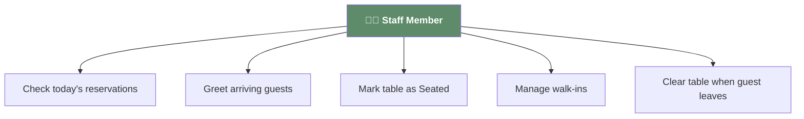
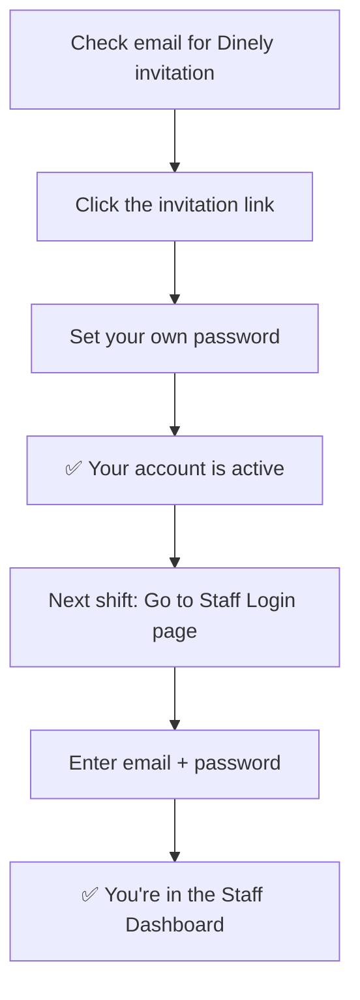
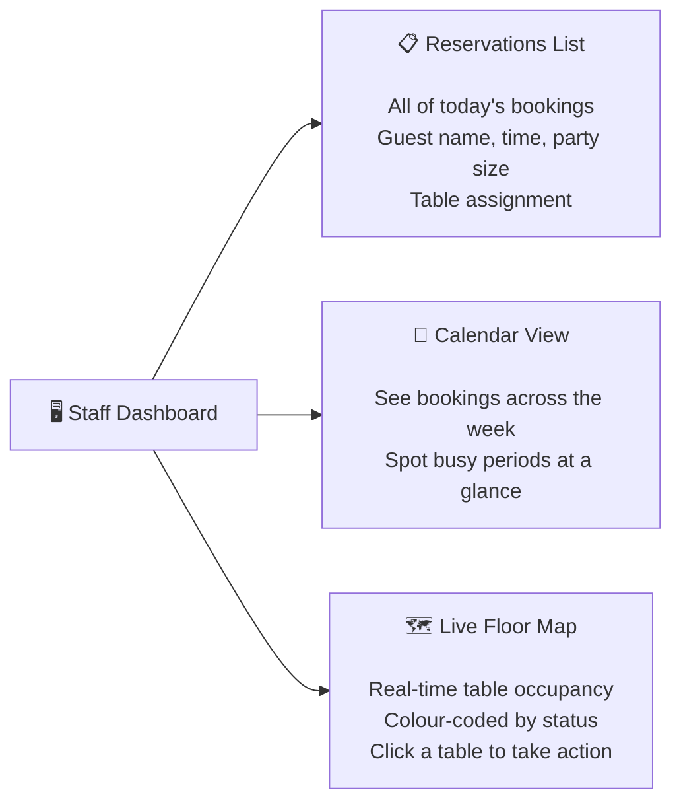
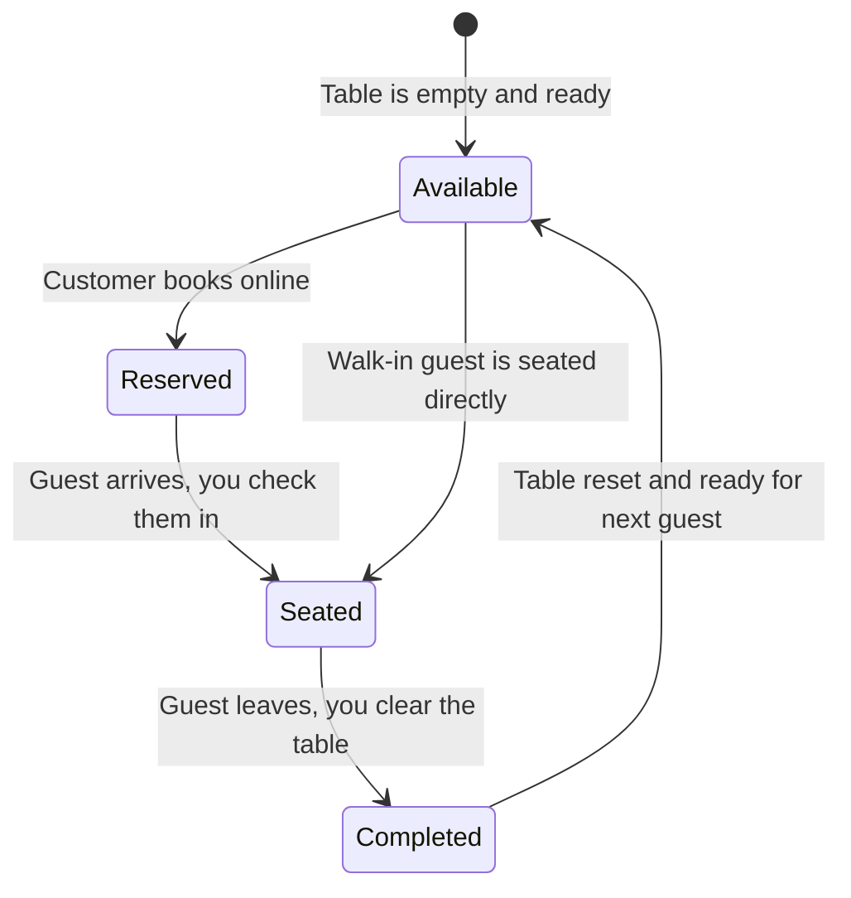
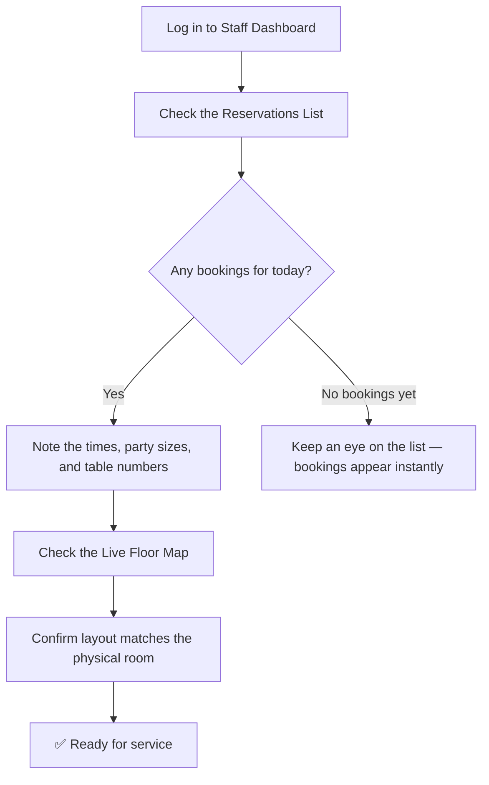
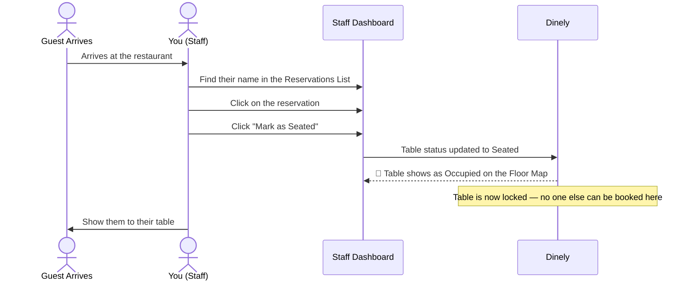
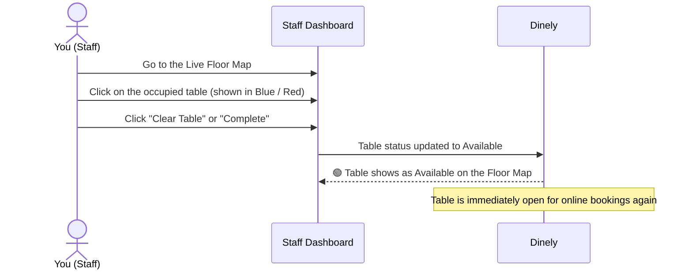
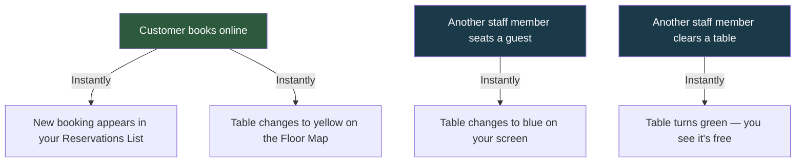
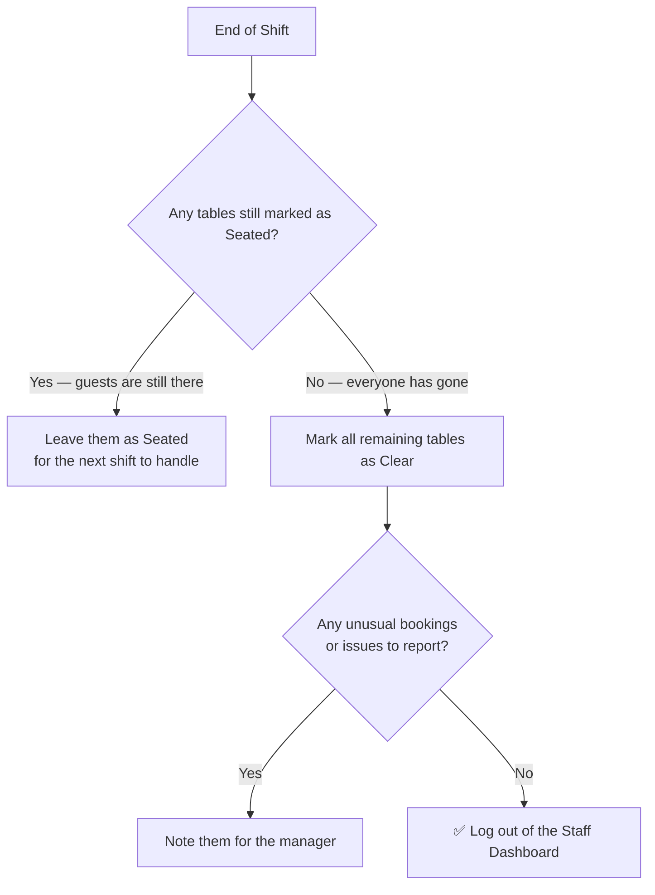

# Dinely — Staff Guide

**Who is this guide for?** This guide is for the front-of-house team — hosts, servers, and managers who need to use the Staff Dashboard on a daily basis during a shift. No technical experience needed.

---

## Your Role as Staff

Your job in Dinely is simple: you are the link between what happens on the screen and what happens in the physical dining room. You greet guests, check them in on the dashboard, and mark tables as free when guests leave. The system does the rest.



---

## Logging In

Your manager will send you an invitation email before your first shift. Once you have set your password, you log in at the Staff Login page.



> **Tip:** Bookmark the Staff Login page on the tablet or device you use at work so you can log in quickly at the start of every shift.

---

## Overview: The Staff Dashboard

When you log in, you land on the Staff Dashboard. Here is what you will see:



---

## Understanding Table Statuses

Every table is always in one of these states. They are colour-coded so you can understand the whole room in seconds.



| Status | What it Means | Who Changes It |
|---|---|---|
| **Available** 🟢 | Empty table, ready for guests | Automatic when cleared |
| **Reserved** 🟡 | An online booking is coming | Automatic when booking is made |
| **Seated** 🔵 | Guests are currently at the table | You do this when guest arrives |
| **Completed** ✅ | Guests have left, table being reset | You do this when guests leave |

---

## Your Daily Workflow: Start of Shift

Before service begins, take a moment to review the dashboard.



---

## Checking In a Guest (A Guest Has Arrived)

This is the most common action you will perform during a shift.



**On the floor map**, the table will immediately change from **yellow (Reserved)** to **blue (Seated)**, giving you and any other staff member an instant visual confirmation.

---

## Clearing a Table (Guests Have Left)

When a table of guests finishes their meal and leaves, you need to clear the table in the system so it becomes available for the next booking.



> **Why this matters:** As soon as you clear a table, customers on your website can book it for the next available slot. If you forget to clear a table, you may lose potential bookings.

---

## Handling Walk-In Guests

Sometimes guests arrive without a prior booking. Here is how to handle them:

```mermaid
flowchart TD
    A["Walk-in Guest Arrives"] --> B["Check the Live Floor Map"]
    B --> C{Any green (Available) tables?}
    C -->|"Yes"| D["Choose a suitable table based on party size"]
    D --> E["Show the guest to the table"]
    E --> F["Find the table in the Floor Map and click on it"]
    F --> G["Click 'Mark as Seated' or Add Walk-in"]
    G --> H["✅ Table is now locked — no online double-booking"]
    C -->|"No"| I["Apologise and offer a wait time"]
    I --> J["Monitor the map and seat them\nwhen a table becomes Available"]
```

> **Important:** Always mark walk-in guests on the system. If you seat someone without updating the dashboard, Dinely might still offer that table for online booking, causing a double-booking.

---

## Real-Time Updates: What to Expect

The Staff Dashboard updates **automatically without refreshing the page.** Here is what you will see happen in real time:



You do not need to do anything for these updates — they just happen.

---

## End of Shift Checklist

Before you hand over or log out, run through this:



---

## Quick Reference: What Each Button Does

| Button | When to Use It | What Happens |
|---|---|---|
| **Mark as Seated** | Guest arrives for their booking | Table turns blue, locked as occupied |
| **Clear Table** | Guests have left and table is reset | Table turns green, available for new bookings |
| **Add Walk-in** | Unplanned guest arrives | Creates a quick manual booking and marks table |
| **Calendar View** | Planning ahead for busy nights | Shows all bookings laid out by time and day |

---

## Troubleshooting: Common Questions

**Q: A booking appeared on my screen but I can't see the table on the floor map.**
→ The admin may not have assigned that booking to a specific table. Check the Reservations List for the table number.

**Q: I accidentally cleared a table but the guests are still there.**
→ Find the table on the floor map or reservations list and mark it as Seated again.

**Q: The dashboard seems slow or isn't updating.**
→ Refresh your browser page. If the issue continues, check your internet connection.

**Q: A guest says they have a booking, but I can't find it.**
→ Search by their last name in the Reservations List. If it still doesn't appear, ask your manager to check the admin panel.

---

*For system setup and configuration, see the **Admin Guide**. For the full platform overview, see the **Client Overview**.*
